# Agency Agents - AI Context Documentation

> **Last Updated**: 2026-03-16 02:11:39 UTC
> **Version**: 1.0.0
> **Coverage**: 100% (138 agents across 12 categories)

## 📋 Table of Contents

- [Project Vision](#project-vision)
- [Architecture Overview](#architecture-overview)
- [Module Structure](#module-structure)
- [Quick Start](#quick-start)
- [Development Workflow](#development-workflow)
- [Testing & Quality](#testing--quality)
- [Agent Design Guidelines](#agent-design-guidelines)
- [Integration Guide](#integration-guide)
- [AI Usage Guidelines](#ai-usage-guidelines)
- [Changelog](#changelog)

---

## Project Vision

**Agency Agents** is a comprehensive collection of specialized AI agent personalities designed for professional workflows. Born from a Reddit thread and refined through months of iteration, this project provides:

- **🎯 Specialized Expertise**: 138+ narrowly-focused agents across 12 professional domains
- **🧠 Personality-Driven**: Each agent has a distinct voice, communication style, and approach
- **📋 Deliverable-Focused**: Real code samples, templates, workflows, and measurable outcomes
- **✅ Production-Ready**: Battle-tested workflows with proven success metrics

**Core Philosophy**: Unlike generic "helpful assistant" prompts, Agency Agents provides domain-specific specialists with deep expertise, clear deliverables, and measurable success criteria. Each agent is designed to solve real-world problems in professional contexts.

**Target Users**:
- Software development teams seeking specialized AI assistance
- Design agencies needing consistent creative direction
- Marketing professionals requiring platform-specific expertise
- Product managers and project coordinators
- Game development studios
- Organizations adopting AI-first workflows

---

## Architecture Overview

### High-Level Architecture

The project follows a **flat-file, tool-agnostic** architecture:

```
agency-agents/
├── [category]/              # 12 professional domains
│   └── [agent-name].md      # Individual agent definitions (YAML + Markdown)
├── scripts/                 # Conversion & installation tooling
├── integrations/            # Tool-specific converted files (generated)
├── examples/                # Multi-agent workflow demonstrations
└── .github/                 # CI/CD workflows (agent linting)
```

### Key Design Principles

1. **Single Source of Truth**: Agent definitions live as `.md` files with YAML frontmatter
2. **Tool Agnostic**: Convert to any AI tool format via `scripts/convert.sh`
3. **No Build Step Required**: Direct use with Claude Code, Copilot, etc.
4. **Persona/Operations Split**: Each agent has identity sections (who they are) and operational sections (what they do)
5. **Extensible Integration**: Add new tools by extending the conversion pipeline

### Technology Stack

- **Agent Format**: YAML frontmatter + Markdown body
- **Conversion Pipeline**: Bash scripts (`convert.sh`, `install.sh`)
- **Quality Control**: GitHub Actions workflow for agent validation
- **Supported Tools**: Claude Code, GitHub Copilot, Cursor, Windsurf, Aider, OpenCode, Gemini CLI, Antigravity, OpenClaw, Qwen Code

---

## Module Structure

### 🏗️ Project Structure Diagram

```mermaid
graph TD
    A["(根) agency-agents"] --> B["academic/"];
    A --> C["design/"];
    A --> D["engineering/"];
    A --> E["game-development/"];
    A --> F["marketing/"];
    A --> G["paid-media/"];
    A --> H["sales/"];
    A --> I["product/"];
    A --> J["project-management/"];
    A --> K["testing/"];
    A --> L["support/"];
    A --> M["spatial-computing/"];
    A --> N["specialized/"];
    A --> O["scripts/"];
    A --> P["integrations/"];
    A --> Q["examples/"];

    B --> B1["5 agents: Anthropologist, Geographer, Historian, Narratologist, Psychologist"];
    C --> C1["8 agents: Brand Guardian, UI Designer, UX Architect, etc."];
    D --> D1["24 agents: Frontend Developer, Backend Architect, AI Engineer, etc."];
    E --> E1["19 agents: Unity/Unreal/Godot/Roblox specialists"];
    F --> F1["26 agents: SEO, Social Media, Content Strategists"];
    G --> G1["7 agents: PPC, Programmatic, Tracking specialists"];
    H --> H1["8 agents: Account Strategist, Deal Strategist, etc."];
    I --> I1["5 agents: Product Manager, Trend Researcher, etc."];
    J --> J1["6 agents: Project Shepherd, Studio Producer, etc."];
    K --> K1["8 agents: Accessibility Auditor, Performance Benchmarker, etc."];
    L --> L1["6 agents: Support Responder, Analytics Reporter, etc."];
    M --> M1["6 agents: VisionOS, XR Interface, etc."];
    N --> N1["28 agents: Compliance, Healthcare, Salesforce, etc."];
    O --> O1["convert.sh, install.sh, lint-agents.sh"];
    P --> P1["Tool-specific converted files"];
    Q --> Q1["Multi-agent workflow examples"];

    click B "./academic/CLAUDE.md" "View Academic Agents"
    click C "./design/CLAUDE.md" "View Design Agents"
    click D "./engineering/CLAUDE.md" "View Engineering Agents"
    click E "./game-development/CLAUDE.md" "View Game Development Agents"
    click F "./marketing/CLAUDE.md" "View Marketing Agents"
    click G "./paid-media/CLAUDE.md" "View Paid Media Agents"
    click H "./sales/CLAUDE.md" "View Sales Agents"
    click I "./product/CLAUDE.md" "View Product Agents"
    click J "./project-management/CLAUDE.md" "View Project Management Agents"
    click K "./testing/CLAUDE.md" "View Testing Agents"
    click L "./support/CLAUDE.md" "View Support Agents"
    click M "./spatial-computing/CLAUDE.md" "View Spatial Computing Agents"
    click N "./specialized/CLAUDE.md" "View Specialized Agents"
```



### 📊 Module Index

| Category | Agent Count | Description | Key Agents |
|----------|-------------|-------------|------------|
| **Academic** | 5 | Academic research and analysis specialists | Academic Anthropologist, Academic Geographer, Academic Historian |
| **Design** | 8 | UX/UI design and creative specialists | Brand Guardian, UI Designer, UX Architect, UX Researcher |
| **Engineering** | 24 | Software development and technical specialists | Frontend Developer, Backend Architect, AI Engineer, Software Architect |
| **Game Development** | 19 | Game design and development across platforms | Unity Architect, Unreal Systems Engineer, Godot Gameplay Scripter |
| **Marketing** | 26 | Digital marketing and growth specialists | AI Citation Strategist, SEO Specialist, Social Media Strategist |
| **Paid Media** | 7 | Paid advertising and media buying | PPC Strategist, Programmatic Buyer, Tracking Specialist |
| **Sales** | 8 | Sales strategy and operations | Account Strategist, Deal Strategist, Sales Coach |
| **Product** | 5 | Product management and strategy | Product Manager, Trend Researcher, Feedback Synthesizer |
| **Project Management** | 6 | Project coordination and operations | Project Shepherd, Studio Producer, Jira Workflow Steward |
| **Testing** | 8 | QA and testing specialists | Accessibility Auditor, Performance Benchmarker, Evidence Collector |
| **Support** | 6 | Operations and support specialists | Support Responder, Analytics Reporter, Infrastructure Maintainer |
| **Spatial Computing** | 6 | AR/VR/XR and visionOS specialists | VisionOS Spatial Engineer, XR Interface Architect |
| **Specialized** | 28 | Industry-specific and niche specialists | Salesforce Architect, Healthcare Compliance, Blockchain Security Auditor |

**Total**: **138 agents** across **12 categories**

---

## Quick Start

### Installation Options

#### Option 1: Claude Code (Recommended)

```bash
# Copy agents to Claude Code directory
cp -r agency-agents/* ~/.claude/agents/

# Activate any agent in sessions:
# "Hey Claude, activate Frontend Developer mode"
```

#### Option 2: Automated Installation

```bash
# Run the installer (detects and installs to all available tools)
./scripts/install.sh

# Interactive mode: select which tools to install
./scripts/install.sh --interactive

# Install to specific tool only
./scripts/install.sh --tool claude-code
```

#### Option 3: Manual Installation

```bash
# First, convert agents to tool-specific formats
./scripts/convert.sh

# Then install to specific tools
./scripts/install.sh --tool <tool-name>
```

### Supported Tools

| Tool | Install Path | Status |
|------|--------------|--------|
| **Claude Code** | `~/.claude/agents/` | ✅ Fully Supported |
| **GitHub Copilot** | `~/.github/agents/`, `~/.copilot/agents/` | ✅ Fully Supported |
| **Cursor** | `.cursor/rules/` | ✅ Fully Supported |
| **Windsurf** | `.windsurfrules` | ✅ Fully Supported |
| **Aider** | `CONVENTIONS.md` | ✅ Fully Supported |
| **OpenCode** | `.opencode/agents/` | ✅ Fully Supported |
| **Gemini CLI** | `~/.gemini/extensions/agency-agents/` | ✅ Fully Supported |
| **Antigravity** | `~/.gemini/antigravity/skills/` | ✅ Fully Supported |
| **OpenClaw** | `~/.openclaw/agency-agents/` | ✅ Fully Supported |
| **Qwen Code** | `.qwen/agents/` | ✅ Fully Supported |

### Verification

```bash
# Verify installation
ls -la ~/.claude/agents/ | head -20
ls -la .cursor/rules/ | head -20
```

---

## Development Workflow

### Adding a New Agent

1. **Choose Category**: Select appropriate category directory or create new one
2. **Create Agent File**: Follow [Agent Design Guidelines](#agent-design-guidelines)
3. **Test Locally**: Use agent in real scenarios before contributing
4. **Run Linter**: Validate agent structure with `./scripts/lint-agents.sh`
5. **Submit PR**: Follow [CONTRIBUTING.md](CONTRIBUTING.md) guidelines

### Agent File Template

```markdown
---
name: Agent Name
description: One-line description of specialty and focus
color: colorname or "#hexcode"
emoji: 🎯
vibe: One-line personality hook
---

# Agent Name

## 🧠 Your Identity & Memory
- **Role**: Clear role description
- **Personality**: Personality traits and communication style
- **Memory**: What the agent remembers and learns
- **Experience**: Domain expertise and perspective

## 🎯 Your Core Mission
- Primary responsibility 1 with clear deliverables
- Primary responsibility 2 with clear deliverables
- **Default requirement**: Always-on best practices

## 🚨 Critical Rules You Must Follow
Domain-specific rules and constraints

## 📋 Your Technical Deliverables
Concrete examples with code samples, templates, frameworks

## 🔄 Your Workflow Process
Step-by-step process the agent follows

## 💭 Your Communication Style
How the agent communicates with examples

## 🎯 Your Success Metrics
Measurable outcomes with specific metrics

## 🚀 Advanced Capabilities
Advanced techniques and approaches
```

### Conversion Pipeline

The `scripts/convert.sh` script transforms agent definitions into tool-specific formats:

```bash
# Convert all agents to all tool formats
./scripts/convert.sh

# Convert to specific tool only
./scripts/convert.sh --tool cursor

# Parallel conversion (faster for large updates)
./scripts/convert.sh --parallel --jobs 8
```

**Conversion Flow**:
1. Parse YAML frontmatter from agent `.md` files
2. Extract body content
3. Apply tool-specific transformations
4. Output to `integrations/<tool>/` directory
5. Run `install.sh` to deploy to tool directories

---

## Testing & Quality

### Agent Validation

The project includes automated agent validation via GitHub Actions:

```yaml
# .github/workflows/lint-agents.yml
# Runs on every PR for agent files
# Validates:
# - Required frontmatter fields (name, description)
# - Proper YAML structure
# - Required section headers
# - Markdown formatting
```

Run locally:

```bash
./scripts/lint-agents.sh <agent-files>
```

### Testing Strategy

1. **Real-World Testing**: Use agents in actual workflows before contributing
2. **Cross-Tool Verification**: Test converted files work in target tools
3. **Peer Review**: Community feedback via PRs and Discussions
4. **Success Metrics**: Each agent should include measurable outcomes

### Quality Standards

- ✅ **Narrow Specialization**: Each agent has a specific domain focus
- ✅ **Distinct Personality**: Unique voice and communication style
- ✅ **Concrete Deliverables**: Real code samples, templates, workflows
- ✅ **Measurable Metrics**: Specific success criteria with numbers
- ✅ **Proven Workflows**: Battle-tested methodologies, not theoretical

---

## Agent Design Guidelines

### Agent Structure

Each agent is organized into two semantic groups:

#### Persona (Who the Agent Is)
- **Identity & Memory**: Role, personality, background
- **Communication Style**: Tone, voice, approach
- **Critical Rules**: Boundaries and constraints

#### Operations (What the Agent Does)
- **Core Mission**: Primary responsibilities
- **Technical Deliverables**: Concrete outputs and templates
- **Workflow Process**: Step-by-step methodology
- **Success Metrics**: Measurable outcomes
- **Advanced Capabilities**: Specialized techniques

### Design Principles

1. **🎭 Strong Personality**: Distinct voice, not generic "helpful assistant"
2. **📋 Clear Deliverables**: Concrete code examples, templates, frameworks
3. **✅ Success Metrics**: Specific, measurable outcomes with numbers
4. **🔄 Proven Workflows**: Real-world tested approaches
5. **💡 Learning Memory**: Patterns recognition and improvement over time

### External Services

Agents may depend on external services when essential:

1. Declare in frontmatter with `services` field
2. Agent must stand alone without the service
3. Reference vendor docs, don't reproduce them
4. Prefer services with free tiers for testing

### What Makes a Great Agent?

**Great agents have**:
- ✅ Narrow, deep specialization
- ✅ Distinct personality and voice
- ✅ Concrete code/template examples
- ✅ Measurable success metrics
- ✅ Step-by-step workflows
- ✅ Real-world testing

**Avoid**:
- ❌ Generic "helpful assistant" personality
- ❌ Vague descriptions
- ❌ No code examples
- ❌ Overly broad scope
- ❌ Untested theoretical approaches

---

## Integration Guide

### Tool-Specific Compatibility

**Qwen Code**: Supports `${variable}` templating for dynamic context. Minimal frontmatter: only `name` and `description` required.

**OpenCode**: Supports color hex codes, mode specification, and full YAML frontmatter.

**OpenClaw**: Splits agents into `SOUL.md` (persona) and `AGENTS.md` (operations) files.

### Adding New Tool Integrations

To add support for a new AI tool:

1. **Create converter function** in `scripts/convert.sh`
2. **Create installer function** in `scripts/install.sh`
3. **Add tool detection** logic in `install.sh`
4. **Update documentation** with tool specifics
5. **Test conversion** with existing agents

Example integration pattern:

```bash
# In convert.sh
convert_newtool() {
  local file="$1"
  local name description body
  name="$(get_field "name" "$file")"
  description="$(get_field "description" "$file")"
  body="$(get_body "$file")"
  # Generate tool-specific format
}

# In install.sh
install_newtool() {
  local src="$INTEGRATIONS/newtool"
  local dest="$NEWTOOL_CONFIG_PATH"
  # Copy files to tool directory
}
```

---

## AI Usage Guidelines

### Best Practices for AI Assistants

When using Agency Agents with AI coding assistants:

1. **Be Specific**: Reference agents by name in prompts
   - ✅ "Use the Frontend Developer agent to review this component"
   - ❌ "Help me with this frontend code"

2. **Provide Context**: Give relevant background and requirements
   - ✅ "As a Product Manager, prioritize these backlog items for Q2"
   - ❌ "Prioritize these tasks"

3. **Use Multiple Agents**: Combine specialists for complex tasks
   - ✅ "Use UX Researcher for personas, then UI Designer for mockups"
   - ❌ "Design this feature"

4. **Follow Workflows**: Let agents guide their documented processes
   - ✅ "Follow the Accessibility Auditor's workflow for this audit"
   - ❌ "Check accessibility"

### Common Use Cases

**Software Development**:
- Frontend Developer + Backend Architect = Full feature implementation
- Code Reviewer + Security Engineer = Comprehensive code audit
- SRE + Devops Automator = Infrastructure deployment

**Product Development**:
- Product Manager + UX Researcher = User research and feature definition
- UI Designer + Frontend Developer = Design system implementation
- Growth Hacker + SEO Specialist = Launch strategy

**Marketing Campaigns**:
- Content Creator + Social Media Strategist = Campaign content
- SEO Specialist + AI Citation Strategist = Search and AI visibility
- Reddit Community Builder + Twitter Engager = Community engagement

### Multi-Agent Orchestration

The `examples/` directory demonstrates how to orchestrate multiple agents:

```markdown
1. Define objective
2. Select relevant agents
3. Run agents in parallel or sequence
4. Synthesize outputs
5. Iterate as needed
```

Example: [nexus-spatial-discovery.md](examples/nexus-spatial-discovery.md) - 8 agents working in parallel on product discovery.

---

## Changelog

### 2026-03-16 - Initial Documentation
- 📊 **Project Scan Complete**: Identified 138 agents across 12 categories
- ✨ **Documentation Created**: Comprehensive root-level CLAUDE.md
- 🏗️ **Structure Diagram**: Added Mermaid visualization of project structure
- 📋 **Module Index**: Complete catalog of all agents by category
- 🔧 **Integration Guide**: Tool installation and conversion pipeline documentation
- 📖 **Best Practices**: AI usage guidelines and multi-agent orchestration
- ✅ **100% Coverage**: All agents and modules documented

---

## 🔗 Resources

- **[README.md](README.md)** - Project overview and quick start
- **[CONTRIBUTING.md](CONTRIBUTING.md)** - Contribution guidelines and agent design
- **[examples/](examples/)** - Multi-agent workflow demonstrations
- **[scripts/](scripts/)** - Conversion and installation tooling
- **[GitHub Issues](https://github.com/msitarzewski/agency-agents/issues)** - Bug reports and feature requests
- **[GitHub Discussions](https://github.com/msitarzewski/agency-agents/discussions)** - Community discussions

---

<div align="center">

**Agency Agents** - Your AI-Powered Professional Team

138 Specialized Agents • 12 Categories • Production-Ready Workflows

</div>
