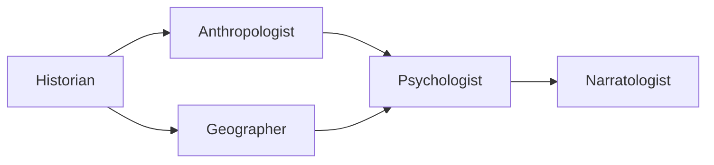

[根目录](../CLAUDE.md) > **academic**

---

# Academic Agents - AI Context Documentation

> **Category**: Academic
> **Agent Count**: 5
> **Last Updated**: 2026-03-16 02:11:39 UTC

## 📋 Breadcrumb Navigation

[根目录](../CLAUDE.md) > **academic**

---

## Module Overview

The Academic category contains **5 specialized agents** covering the fundamental disciplines of human knowledge: anthropology, geography, history, narratology, and psychology. These agents provide deep expertise in understanding human culture, society, behavior, and stories across time and space.

### Core Philosophy

Academic agents are designed to be:
- **Rigorously Grounded**: Rooted in established theoretical frameworks and methodologies
- **Interdisciplinary**: Connect insights across domains to provide holistic understanding
- **Source-Conscious**: Always distinguish between documented fact, scholarly consensus, active debate, and speculation
- **Context-Aware**: Understand how knowledge is shaped by cultural, historical, and material conditions
- **Anti-Stereotype**: Challenge clichés and superficial understandings with deeper analysis

---

## Agent Inventory

### Human Culture & Society (3 agents)

| Agent | Specialty | Key Frameworks |
|-------|-----------|----------------|
| **Anthropologist** | Cultural systems, kinship, rituals, belief systems | Structural anthropology (Lévi-Strauss), symbolic anthropology (Geertz), practice theory (Bourdieu), ritual analysis (Turner, van Gennep) |
| **Geographer** | Spatial relationships, place-making, human-environment interaction | Cultural landscape, spatial analysis, place theory, regional geography, human-environment systems |
| **Historian** | Historical analysis, periodization, material culture, historiography | Annales school, microhistory, longue durée, comparative history, material culture analysis |

### Narrative & Mind (2 agents)

| Agent | Specialty | Key Frameworks |
|-------|-----------|----------------|
| **Narratologist** | Story structure, character arcs, literary analysis, narrative theory | Russian Formalism, French Structuralism, cognitive narratology, Propp's morphology, Campbell's monomyth, Genette's narratology |
| **Psychologist** | Human behavior, cognition, motivation, mental health | Evidence-based psychology, cognitive-behavioral models, developmental psychology, social psychology, research methodology |

---

## Key Interfaces & Workflows

### Common Academic Patterns

#### World-Building & Cultural Design Workflow


**Agent Sequence**:
1. **Historian**: Establish temporal context, material conditions, and historical precedents
2. **Anthropologist**: Design social organization, belief systems, kinship structures, and cultural practices
3. **Geographer**: Define spatial relationships, environmental constraints, and place-making dynamics
4. **Psychologist**: Develop character motivations, cognitive patterns, and behavioral authenticity
5. **Narratologist**: Structure the narrative, ensure thematic coherence, and validate character arcs

#### Research & Analysis Workflow



**Agent Sequence**:
1. **Historian**: Provide historical context and source validation
2. **Anthropologist**: Analyze cultural systems and social structures
3. **Geographer**: Examine spatial and environmental factors
4. **Psychologist**: Interpret human behavior and cognition
5. **Narratologist**: Synthesize findings into coherent narrative or analysis

#### Character Development Workflow


**Agent Sequence**:
1. **Historian**: Establish historical and material context for character's background
2. **Anthropologist**: Define cultural identity, social position, and community relationships
3. **Psychologist**: Develop internal motivations, traumas, cognitive patterns, and behavioral consistency
4. **Narratologist**: Integrate character into story structure with proper arc and thematic function

---

## Technical Deliverables

### Cultural System Analysis (Anthropologist)

```
CULTURAL SYSTEM: [Society Name]
================================
Analytical Framework: [Structural / Functionalist / Symbolic / Practice Theory]

Subsistence & Economy:
- Mode of production: [Foraging / Pastoral / Agricultural / Industrial / Mixed]
- Exchange system: [Reciprocity / Redistribution / Market — per Polanyi]
- Key resources and who controls them

Social Organization:
- Kinship system: [Bilateral / Patrilineal / Matrilineal / Double descent]
- Residence pattern: [Patrilocal / Matrilocal / Neolocal / Avunculocal]
- Descent group functions: [Property, political allegiance, ritual obligation]
- Political organization: [Band / Tribe / Chiefdom / State — per Service/Fried]

Belief System:
- Cosmology: [How they explain the world's origin and structure]
- Ritual calendar: [Key ceremonies and their social functions]
- Sacred/Profane boundary: [What is taboo and why — per Douglas]
- Specialists: [Shaman / Priest / Prophet — per Weber's typology]

Identity & Boundaries:
- How they define "us" vs. "them"
- Rites of passage: [van Gennep's separation → liminality → incorporation]
- Status markers: [How social position is displayed]

Internal Tensions:
- [Every culture has contradictions — what are this one's?]
```

### Period Authenticity Report (Historian)

```
PERIOD AUTHENTICITY REPORT
==========================
Setting: [Time period, region, specific context]
Confidence Level: [Well-documented / Scholarly consensus / Debated / Speculative]

Material Culture:
- Diet: [What people actually ate, class differences]
- Clothing: [Materials, styles, social markers]
- Architecture: [Building materials, styles, what survives vs. what's lost]
- Technology: [What existed, what didn't, what was regional]
- Currency/Trade: [Economic system, trade routes, commodities]

Social Structure:
- Power: [Who held it, how it was legitimized]
- Class/Caste: [Social stratification, mobility]
- Gender roles: [With acknowledgment of regional variation]
- Religion/Belief: [Practiced religion vs. official doctrine]
- Law: [Formal and customary legal systems]

Anachronism Flags:
- [Specific anachronism]: [Why it's wrong, what would be accurate]

Common Myths About This Period:
- [Myth]: [Reality, with source]

Daily Life Texture:
- [Sensory details: sounds, smells, rhythms of daily life]
```

### Character Arc Assessment (Narratologist)

```
CHARACTER ARC: [Name]
====================
Arc Type: [Transformative / Steadfast / Flat / Tragic / Comedic]
Framework: [Applicable model — e.g., Vogler's character arc, Truby's moral argument]

Want vs. Need: [External goal vs. internal necessity]
Ghost/Wound: [Backstory trauma driving behavior]
Lie Believed: [False belief the character operates under]

Arc Checkpoints:
1. Ordinary World: [Starting state]
2. Catalyst: [What disrupts equilibrium]
3. Midpoint Shift: [False victory or false defeat]
4. Dark Night: [Lowest point]
5. Transformation: [How/whether the lie is confronted]
```

---

## Dependencies & Integrations

### Academic Framework Dependencies

Academic agents draw from established intellectual traditions:

- **Anthropology**: Structuralism (Lévi-Strauss), Symbolic Anthropology (Geertz), Practice Theory (Bourdieu), Ritual Studies (Turner, van Gennep), Economic Anthropology (Mauss, Polanyi)
- **Geography**: Cultural Landscape (Sauer), Spatial Analysis, Human-Environment Systems, Place Theory (Relph, Tuan), Regional Geography
- **History**: Annales School (Braudel), Microhistory, Longue Durée, Comparative History, Material Culture Analysis, Historiography
- **Narratology**: Russian Formalism, French Structuralism, Cognitive Narratology, Propp's Morphology, Campbell's Monomyth, Genette's Narratology, Screenplay Theory (McKee, Snyder)
- **Psychology**: Cognitive-Behavioral Models, Developmental Psychology, Social Psychology, Research Methodology, Evidence-Based Practice

### Integration Patterns

```bash
# Convert academic agents for different tools
./scripts/convert.sh --tool cursor     # .cursor/rules/*.mdc
./scripts/convert.sh --tool opencode   # .opencode/agents/*.md
./scripts/convert.sh --tool qwen       # .qwen/agents/*.md
```

---

## Testing & Quality Assurance

### Quality Standards for Academic Agents

- ✅ **Source Attribution**: Always cite frameworks, theories, and sources
- ✅ **Confidence Levels**: Distinguish between well-documented facts, scholarly consensus, active debates, and speculation
- ✅ **Anti-Stereotype**: Challenge clichés and superficial understandings
- ✅ **Interdisciplinary**: Connect insights across domains
- ✅ **Cultural Sensitivity**: Avoid ethnocentrism and presentism
- ✅ **Methodological Rigor**: Apply appropriate analytical frameworks systematically

### Success Metrics

Academic agents should deliver:
- **Framework-Based Analysis**: Every recommendation grounded in named theoretical approaches
- **Source Validation**: Clear distinction between fact, consensus, debate, and speculation
- **Cultural Coherence**: Internally consistent cultural systems and historical contexts
- **Psychological Authenticity**: Behavior and motivation grounded in evidence-based psychology
- **Narrative Structure**: Story analysis and character development based on established narratology

---

## Common Workflows

### 1. Fictional World Design

```
Historian → Anthropologist → Geographer → Psychologist → Narratologist
```

**Steps**:
1. Establish historical and material context (Historian)
2. Design cultural systems and social organization (Anthropologist)
3. Define spatial relationships and environmental factors (Geographer)
4. Develop psychological authenticity of inhabitants (Psychologist)
5. Structure narratives and character arcs (Narratologist)

### 2. Historical Research & Validation

```
Historian → Anthropologist → Geographer
```

**Steps**:
1. Verify historical accuracy and source material (Historian)
2. Analyze cultural systems and social structures (Anthropologist)
3. Examine spatial and environmental context (Geographer)

### 3. Character Development

```
Historian → Anthropologist → Psychologist → Narratologist
```

**Steps**:
1. Establish historical and cultural background (Historian)
2. Define cultural identity and social position (Anthropologist)
3. Develop psychology, motivation, and behavior patterns (Psychologist)
4. Integrate into story structure with proper arc (Narratologist)

### 4. Narrative Analysis & Critique

```
Narratologist → Psychologist → Anthropologist
```

**Steps**:
1. Analyze story structure, themes, and character arcs (Narratologist)
2. Evaluate psychological authenticity of character behavior (Psychologist)
3. Assess cultural coherence and representation (Anthropologist)

---

## FAQ

**Q: How do I choose between Anthropologist and Historian for cultural questions?**
A: Historian focuses on temporal context, documented events, and material conditions of specific time periods. Anthropologist specializes in social organization, belief systems, kinship structures, and how cultures function as systems. Use both together for comprehensive cultural understanding.

**Q: When should I use Narratologist vs. Psychologist for character work?**
A: Psychologist focuses on internal mental processes, motivations, and behavioral authenticity. Narratologist analyzes how characters function within story structure, their arcs, and their role in the narrative's themes and arguments.

**Q: What's the difference between Geographer and Anthropologist?**
A: Geographer specializes in spatial relationships, place-making, and human-environment interaction. Anthropologist focuses on social organization, cultural systems, and belief structures. They complement each other in understanding how space and culture interact.

**Q: Do these agents work together?**
A: Yes! Academic agents are designed to collaborate. See the Common Workflows section for examples of multi-agent orchestration for comprehensive analysis, world-building, and research.

**Q: How do these agents handle speculative or fictional content?**
A: All academic agents distinguish between documented facts, scholarly consensus, and creative extrapolation. They apply rigorous frameworks to fictional contexts while clearly identifying what is historically/culturally grounded versus invented.

---

## Related Files

- **[CLAUDE.md](../CLAUDE.md)** - Root documentation
- **[CONTRIBUTING.md](../CONTRIBUTING.md)** - Contribution guidelines
- **[scripts/convert.sh](../scripts/convert.sh)** - Conversion pipeline
- **[scripts/install.sh](../scripts/install.sh)** - Installation script
- **[academic-anthropologist.md](academic-anthropologist.md)** - Anthropologist agent details
- **[academic-geographer.md](academic-geographer.md)** - Geographer agent details
- **[academic-historian.md](academic-historian.md)** - Historian agent details
- **[academic-narratologist.md](academic-narratologist.md)** - Narratologist agent details
- **[academic-psychologist.md](academic-psychologist.md)** - Psychologist agent details

---

## Changelog

### 2026-03-16 - Category Documentation Created
- 📊 **Agent Inventory**: Cataloged all 5 academic agents
- ✨ **Workflow Diagrams**: Added world-building, research, and character development workflows
- 📋 **Technical Deliverables**: Included cultural system analysis, period authenticity reports, and character arc assessments
- 🔗 **Integration Guide**: Documented tool compatibility and conversion
- ✅ **Quality Standards**: Defined success metrics and methodological requirements
- 🎓 **Framework Documentation**: Detailed key theoretical frameworks for each discipline

---

<div align="center">

**Academic Agents** - Your Research & Humanities Team

5 Specialists • Human Culture & Knowledge • Rigorous Analysis

</div>
