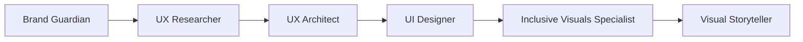
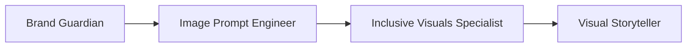
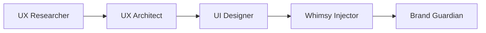

[根目录](../CLAUDE.md) > **design**

---

# Design Agents - AI Context Documentation

> **Category**: Design
> **Agent Count**: 8
> **Last Updated**: 2026-03-16 02:11:39 UTC

## 📋 Breadcrumb Navigation

[根目录](../CLAUDE.md) > **design**

---

## Module Overview

The Design category contains **8 specialized agents** covering the complete design spectrum, from brand strategy and user research to UI design, visual storytelling, and inclusive representation. These agents work together to create cohesive, accessible, and emotionally resonant design systems.

### Core Philosophy

Design agents are designed to be:
- **Human-Centered**: User needs, accessibility, and inclusive representation drive all decisions
- **Brand-Aware**: Strategic brand thinking ensures consistency and differentiation
- **Technically Precise**: Design systems, CSS architecture, and implementation-ready specifications
- **Culturally Conscious**: Authentic representation and sensitivity to diverse audiences
- **Deliverable-Focused**: Real design systems, prompts, prototypes, and implementation guides

---

## Agent Inventory

### Brand Strategy & Identity (1 agent)

| Agent | Specialty | Key Expertise |
|-------|-----------|---------------|
| **Brand Guardian** | Brand identity development, consistency maintenance, strategic positioning | Brand strategy, visual identity systems, brand protection, messaging architecture |

### User Experience & Research (2 agents)

| Agent | Specialty | Key Expertise |
|-------|-----------|---------------|
| **UX Researcher** | User research, usability testing, behavior analysis | Research methodologies, user interviews, data analysis, persona development |
| **UX Architect** | Technical architecture, CSS systems, UX foundations | Design systems, layout frameworks, responsive strategy, developer handoff |

### Visual & Interface Design (3 agents)

| Agent | Specialty | Key Expertise |
|-------|-----------|---------------|
| **UI Designer** | Visual design systems, component libraries, pixel-perfect interfaces | Design tokens, component architecture, accessibility implementation, responsive design |
| **Visual Storyteller** | Visual narratives, multimedia content, brand storytelling | Story arc development, data visualization, multimedia design, cross-platform adaptation |
| **Image Prompt Engineer** | AI image generation, photography prompting, visual concept translation | Photography terminology, lighting specifications, prompt optimization, style references |

### Inclusive & Creative Design (2 agents)

| Agent | Specialty | Key Expertise |
|-------|-----------|---------------|
| **Inclusive Visuals Specialist** | Authentic representation, bias-free imagery, cultural accuracy | AI bias mitigation, cultural specificity, dignified representation, video physics |
| **Whimsy Injector** | Creative breakthroughs, innovative concepts, playful design | Lateral thinking, creative constraints, unexpected solutions, brand-aligned innovation |

---

## Key Interfaces & Workflows

### Common Design Patterns

#### Complete Design System Workflow



**Agent Sequence**:
1. **Brand Guardian**: Establish brand foundation, visual identity, and strategic positioning
2. **UX Researcher**: Conduct user research, analyze needs, develop personas and journey maps
3. **UX Architect**: Create technical foundation, CSS systems, and responsive framework
4. **UI Designer**: Design component library, visual hierarchy, and interface specifications
5. **Inclusive Visuals Specialist**: Ensure authentic representation and cultural accuracy
6. **Visual Storyteller**: Develop brand narratives and multimedia content strategy

#### AI Image Generation Workflow



**Agent Sequence**:
1. **Brand Guardian**: Define brand visual identity and style parameters
2. **Image Prompt Engineer**: Craft detailed prompts with technical photography specifications
3. **Inclusive Visuals Specialist**: Review and refine prompts for authentic representation
4. **Visual Storyteller**: Integrate generated imagery into cohesive narrative campaigns

#### Product Design Workflow



**Agent Sequence**:
1. **UX Researcher**: Research user needs and validate problem space
2. **UX Architect**: Design UX foundation and technical architecture
3. **UI Designer**: Create visual interface and component system
4. **Whimsy Injector**: Add innovative elements and creative differentiation
5. **Brand Guardian**: Ensure brand consistency and strategic alignment

---

## Technical Deliverables

### Brand Guardian Output Example

```markdown
# Brand Foundation Document

## Brand Purpose
Why the brand exists beyond making profit - the meaningful impact and value creation

## Brand Vision
Aspirational future state - where the brand is heading and what it will achieve

## Brand Mission
What the brand does and for whom - the specific value delivery and target audience

## Brand Values
Core principles that guide all brand behavior and decision-making:
1. [Primary Value]: [Definition and behavioral manifestation]
2. [Secondary Value]: [Definition and behavioral manifestation]
3. [Supporting Value]: [Definition and behavioral manifestation]

## Brand Personality
Human characteristics that define brand character:
- [Trait 1]: [Description and expression]
- [Trait 2]: [Description and expression]
- [Trait 3]: [Description and expression]

## Brand Promise
Commitment to customers and stakeholders - what they can always expect
```

### UX Architect Output Example

```css
/* Design Token System */
:root {
  /* Light Theme Colors */
  --bg-primary: #ffffff;
  --bg-secondary: #f9fafb;
  --text-primary: #111827;
  --text-secondary: #6b7280;
  --border-color: #e5e7eb;

  /* Brand Colors */
  --primary-color: #3b82f6;
  --secondary-color: #8b5cf6;
  --accent-color: #ec4899;

  /* Typography Scale */
  --text-xs: 0.75rem;    /* 12px */
  --text-sm: 0.875rem;   /* 14px */
  --text-base: 1rem;     /* 16px */
  --text-lg: 1.125rem;   /* 18px */
  --text-xl: 1.25rem;    /* 20px */
  --text-2xl: 1.5rem;    /* 24px */
  --text-3xl: 1.875rem;  /* 30px */

  /* Spacing System */
  --space-1: 0.25rem;   /* 4px */
  --space-2: 0.5rem;    /* 8px */
  --space-4: 1rem;      /* 16px */
  --space-6: 1.5rem;    /* 24px */
  --space-8: 2rem;      /* 32px */
  --space-12: 3rem;     /* 48px */
  --space-16: 4rem;     /* 64px */
}

/* Dark Theme */
[data-theme="dark"] {
  --bg-primary: #111827;
  --bg-secondary: #1f2937;
  --text-primary: #f9fafb;
  --text-secondary: #9ca3af;
  --border-color: #374151;
}

/* System Theme Preference */
@media (prefers-color-scheme: dark) {
  :root:not([data-theme="light"]) {
    --bg-primary: #111827;
    --bg-secondary: #1f2937;
    --text-primary: #f9fafb;
    --text-secondary: #9ca3af;
    --border-color: #374151;
  }
}
```

### UI Designer Output Example

```markdown
# [Project Name] UI Design System

## 🎨 Design Foundations

### Color System
**Primary Colors**: [Brand color palette with hex values]
**Secondary Colors**: [Supporting color variations]
**Semantic Colors**: [Success, warning, error, info colors]
**Neutral Palette**: [Grayscale system for text and backgrounds]
**Accessibility**: [WCAG AA compliant color combinations]

### Typography System
**Primary Font**: [Main brand font for headlines and UI]
**Secondary Font**: [Body text and supporting content font]
**Font Scale**: [12px → 14px → 16px → 18px → 24px → 30px → 36px]
**Font Weights**: [400, 500, 600, 700]
**Line Heights**: [Optimal line heights for readability]

### Spacing System
**Base Unit**: 4px
**Scale**: [4px, 8px, 12px, 16px, 24px, 32px, 48px, 64px]
**Usage**: [Consistent spacing for margins, padding, and component gaps]

## 🧱 Component Library

### Base Components
**Buttons**: [Primary, secondary, tertiary variants with sizes]
**Form Elements**: [Inputs, selects, checkboxes, radio buttons]
**Navigation**: [Menu systems, breadcrumbs, pagination]
**Feedback**: [Alerts, toasts, modals, tooltips]
**Data Display**: [Cards, tables, lists, badges]

### Component States
**Interactive States**: [Default, hover, active, focus, disabled]
**Loading States**: [Skeleton screens, spinners, progress bars]
**Error States**: [Validation feedback and error messaging]
**Empty States**: [No data messaging and guidance]
```

### Image Prompt Engineer Output Example

```typescript
// Portrait Photography Prompt Generator
export function generatePortraitPrompt(
  subject: string,
  style: 'editorial' | 'corporate' | 'artistic',
  mood: string
) {
  return `
  [SUBJECT]: ${subject}, detailed facial expression, natural pose
  [LIGHTING]: Softbox setup with key light at 45°, fill light for shadow control, rim light for separation
  [CAMERA]: 85mm lens, f/1.4 aperture, shallow depth of field, eye-level perspective
  [BACKGROUND]: Blurred environmental context, warm color palette
  [STYLE]: ${style} photography, high-end retouching, color grading
  [MOOD]: ${mood}, authentic emotional resonance
  [TECHNICAL]: 4K resolution, professional studio lighting, commercial photography standards
  [NEGATIVE]: No harsh shadows, no oversaturation, no artificial filters
  `;
}
```

### Inclusive Visuals Specialist Output Example

```typescript
// Bias-Free Video Prompt Generator
export function generateInclusiveVideoPrompt(
  subject: string,
  action: string,
  context: string
) {
  return `
  [SUBJECT & ACTION]: ${subject}, ${action}
  [CONTEXT]: ${context}, authentic environmental details
  [CAMERA & PHYSICS]: Cinematic tracking shot, 4K resolution, 24fps. Natural movement, consistent physics
  [LIGHTING]: Soft directional lighting, expertly graded for natural skin tone rendering
  [NEGATIVE CONSTRAINTS]: No generic stock photo smiles, no hyper-saturated lighting, no cloned background actors. Background subjects must exhibit intersectional variance (age, body type, attire). No text or symbols in frame. No stereotypical cultural markers.
  [REPRESENTATION]: Distinct facial structures, authentic cultural clothing, accurate geographical architecture, dignified portrayal
  `;
}
```

---

## Dependencies & Integrations

### Design Tool Dependencies

Design agents reference but are not limited to:

- **Design Platforms**: Figma, Sketch, Adobe XD, InVision, Framer
- **Prototyping Tools**: Figma, Principle, ProtoPie, Axure
- **AI Image Generation**: Midjourney, DALL-E, Stable Diffusion, Flux, Runway, Sora
- **Design Systems**: Material Design, Human Interface Guidelines, Fluent Design
- **Accessibility Tools**: WAVE, axe DevTools, Lighthouse, Contrast Checker
- **User Research**: UserTesting, Dovetail, Maze, Hotjar, Optimal Workshop

### Integration Patterns

```bash
# Convert design agents for different tools
./scripts/convert.sh --tool cursor     # .cursor/rules/*.mdc
./scripts/convert.sh --tool opencode   # .opencode/agents/*.md
./scripts/convert.sh --tool qwen       # .qwen/agents/*.md
```

---

## Testing & Quality Assurance

### Quality Standards for Design Agents

- ✅ **Accessibility**: WCAG 2.1 AA compliance minimum for all deliverables
- ✅ **Brand Consistency**: All design elements align with brand guidelines
- ✅ **Inclusive Representation**: Authentic, dignified portrayal of diverse subjects
- ✅ **Technical Precision**: Accurate specifications for implementation
- ✅ **Cultural Sensitivity**: Appropriate and accurate cultural representation
- ✅ **Cross-Platform**: Designs work across all target devices and platforms

### Success Metrics

Design agents should deliver:
- **Brand Systems**: Comprehensive brand guidelines with clear implementation standards
- **Design Systems**: Complete component libraries with documentation
- **User Research**: Actionable insights with data-backed recommendations
- **Visual Content**: High-quality images and media that meet brand and ethical standards
- **Implementation Guides**: Clear specifications for developers to execute designs
- **Accessibility Compliance**: WCAG compliant designs with inclusive user experience

---

## Common Workflows

### 1. Brand Development Workflow

```
Brand Guardian → UX Researcher → UX Architect → UI Designer → Visual Storyteller
```

**Steps**:
1. Define brand strategy and visual identity (Brand Guardian)
2. Research target audience and market positioning (UX Researcher)
3. Create technical design foundation (UX Architect)
4. Design visual interface and component system (UI Designer)
5. Develop brand narrative and visual storytelling (Visual Storyteller)

### 2. Product Design Workflow

```
UX Researcher → UX Architect → UI Designer → Whimsy Injector → Brand Guardian
```

**Steps**:
1. Conduct user research and define requirements (UX Researcher)
2. Create UX architecture and design system foundation (UX Architect)
3. Design UI components and visual interface (UI Designer)
4. Inject creative elements and innovation (Whimsy Injector)
5. Validate brand alignment (Brand Guardian)

### 3. AI Visual Content Creation Workflow

```
Brand Guardian → Image Prompt Engineer → Inclusive Visuals Specialist → Visual Storyteller
```

**Steps**:
1. Define brand visual guidelines (Brand Guardian)
2. Craft detailed prompts for AI generation (Image Prompt Engineer)
3. Review and refine for authentic representation (Inclusive Visuals Specialist)
4. Integrate into cohesive visual narrative (Visual Storyteller)

---

## FAQ

**Q: How do I choose between UI Designer and UX Architect?**
A: UX Architect focuses on technical foundations, CSS systems, and layout frameworks. UI Designer specializes in visual design, component libraries, and pixel-perfect interface creation. They work together - UX Architect builds the foundation, UI Designer creates the visual layer.

**Q: When should I use Inclusive Visuals Specialist?**
A: Always when generating imagery of people, especially for diverse or marginalized communities. This agent ensures AI-generated media avoids stereotypes, cultural inaccuracies, and representation biases that can harm brand reputation.

**Q: What's the difference between Brand Guardian and Visual Storyteller?**
A: Brand Guardian focuses on strategic brand development, visual identity systems, and consistency. Visual Storyteller specializes in creating visual narratives and multimedia content that communicate brand stories.

**Q: Do design agents work with engineering agents?**
A: Absolutely! Design and engineering agents are designed to collaborate closely. UX Architect provides CSS systems that Frontend Developer implements. UI Designer creates component specifications that guide development. The handoff between design and engineering is seamless.

**Q: Can Whimsy Injector work within brand constraints?**
A: Yes! Whimsy Injector is specifically designed to add creative innovation while respecting brand guidelines. They find creative ways to express brand personality through unexpected elements that still align with brand values.

---

## Related Files

- **[CLAUDE.md](../CLAUDE.md)** - Root documentation
- **[CONTRIBUTING.md](../CONTRIBUTING.md)** - Contribution guidelines
- **[scripts/convert.sh](../scripts/convert.sh)** - Conversion pipeline
- **[scripts/install.sh](../scripts/install.sh)** - Installation script

---

## Changelog

### 2026-03-16 - Category Documentation Created
- 📊 **Agent Inventory**: Cataloged all 8 design agents
- ✨ **Workflow Diagrams**: Added brand development, product design, and AI visual content workflows
- 📋 **Technical Deliverables**: Included brand systems, CSS architecture, design systems, and prompt examples
- 🔗 **Integration Guide**: Documented design tool compatibility and conversion
- ✅ **Quality Standards**: Defined success metrics and accessibility requirements

---

<div align="center">

**Design Agents** - Your Creative Design Team

8 Specialists • Brand to Pixel • Inclusive & Accessible

</div>
