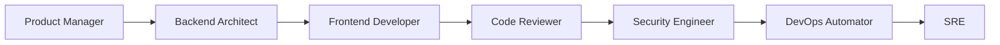
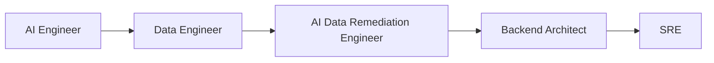

[根目录](../CLAUDE.md) > **engineering**

---

# Engineering Agents - AI Context Documentation

> **Category**: Engineering
> **Agent Count**: 24
> **Last Updated**: 2026-03-16 02:11:39 UTC

## 📋 Breadcrumb Navigation

[根目录](../CLAUDE.md) > **engineering**

---

## Module Overview

The Engineering category contains **24 specialized agents** covering the full software development lifecycle, from frontend and backend development to DevOps, security, and specialized domains like blockchain, mobile, and AI engineering.

### Core Philosophy

Engineering agents are designed to be:
- **Technically Precise**: Modern best practices, current frameworks, proven patterns
- **Deliverable-Focused**: Real code, architecture diagrams, implementation guides
- **Quality-Conscious**: Testing, performance, security, and maintainability built-in
- **Pragmatic**: Balance ideal solutions with real-world constraints

---

## Agent Inventory

### Core Development (6 agents)

| Agent | Specialty | Key Technologies |
|-------|-----------|------------------|
| **Frontend Developer** | Modern web apps, React/Vue/Angular, performance | React, TypeScript, Core Web Vitals, WCAG 2.1 |
| **Backend Architect** | API design, microservices, system architecture | REST/GraphQL, databases, caching, scaling |
| **Senior Developer** | Technical leadership, code review, mentorship | Best practices, design patterns, architecture |
| **Software Architect** | High-level system design, tech stack selection | Distributed systems, architecture patterns |
| **Rapid Prototyper** | Fast MVP development, proof of concepts | Modern frameworks, rapid iteration, UX validation |
| **Code Reviewer** | Code quality, best practices, security | Clean code, SOLID principles, security audits |

### AI & Data Engineering (3 agents)

| Agent | Specialty | Key Technologies |
|-------|-----------|------------------|
| **AI Engineer** | ML pipelines, LLM integration, AI systems | LangChain, vector databases, RAG, fine-tuning |
| **AI Data Remediation Engineer** | Data quality for AI, cleaning, preprocessing | Pandas, data validation, ETL pipelines |
| **Data Engineer** | Data pipelines, ETL, warehousing | SQL, Spark, Airflow, data lakes |

### DevOps & Infrastructure (5 agents)

| Agent | Specialty | Key Technologies |
|-------|-----------|------------------|
| **DevOps Automator** | CI/CD, automation, infrastructure as code | Docker, Kubernetes, Terraform, GitHub Actions |
| **SRE** | Reliability, monitoring, incident response | SLO/SLI, monitoring, alerting, on-call |
| **Incident Response Commander** | Incident management, postmortems | Incident protocols, communication, root cause analysis |
| **Database Optimizer** | Query optimization, indexing, scaling | SQL, NoSQL, query tuning, replication |
| **Infrastructure Maintainer** | System maintenance, updates, monitoring | Linux, monitoring, patching, capacity planning |

### Security (2 agents)

| Agent | Specialty | Key Technologies |
|-------|-----------|------------------|
| **Security Engineer** | Application security, vulnerability assessment | OWASP, security audits, pen testing |
| **Threat Detection Engineer** | Security monitoring, threat hunting | SIEM, log analysis, threat intelligence |

### Specialized Domains (8 agents)

| Agent | Specialty | Key Technologies |
|-------|-----------|------------------|
| **Mobile App Builder** | iOS/Android development, cross-platform | React Native, Flutter, Swift, Kotlin |
| **Embedded Firmware Engineer** | Embedded systems, IoT, firmware | C/C++, RTOS, hardware interfaces |
| **Solidity Smart Contract Engineer** | Blockchain, smart contracts, Web3 | Solidity, Ethereum, DeFi, security |
| **WeChat Mini Program Developer** | WeChat ecosystem, mini programs | WeChat APIs, JavaScript, cloud functions |
| **Feishu Integration Developer** | Feishu (Lark) platform integrations | Feishu APIs, bots, automation |
| **Git Workflow Master** | Git workflows, branching strategies | Git, GitHub/GitLab, CI/CD integration |
| **Technical Writer** | Documentation, API docs, guides | Markdown, docs-as-code, API documentation |

---

## Key Interfaces & Workflows

### Common Development Patterns

#### Full-Stack Development Workflow



**Agent Sequence**:
1. **Product Manager**: Define requirements and acceptance criteria
2. **Backend Architect**: Design API, data model, and system architecture
3. **Frontend Developer**: Implement UI with responsive design and accessibility
4. **Code Reviewer**: Review code quality, best practices, and maintainability
5. **Security Engineer**: Security audit and vulnerability assessment
6. **DevOps Automator**: Set up CI/CD pipeline and infrastructure
7. **SRE**: Monitor deployment and ensure reliability

#### AI System Development Workflow



**Agent Sequence**:
1. **AI Engineer**: Design AI system architecture and LLM integration
2. **Data Engineer**: Build data pipelines and infrastructure
3. **AI Data Remediation Engineer**: Ensure data quality for AI models
4. **Backend Architect**: Integrate AI services into application architecture
5. **SRE**: Monitor AI system performance and reliability

---

## Technical Deliverables

### Frontend Developer Output Example

```typescript
// Modern React component with performance optimization
import React, { memo, useCallback, useMemo } from 'react';
import { useVirtualizer } from '@tanstack/react-virtual';

interface DataTableProps {
  data: Array<Record<string, any>>;
  columns: Column[];
  onRowClick?: (row: any) => void;
}

export const DataTable = memo<DataTableProps>(({ data, columns, onRowClick }) => {
  const parentRef = React.useRef<HTMLDivElement>(null);

  const rowVirtualizer = useVirtualizer({
    count: data.length,
    getScrollElement: () => parentRef.current,
    estimateSize: () => 50,
    overscan: 5,
  });

  const handleRowClick = useCallback((row: any) => {
    onRowClick?.(row);
  }, [onRowClick]);

  return (
    <div
      ref={parentRef}
      className="h-96 overflow-auto"
      role="table"
      aria-label="Data table"
    >
      {rowVirtualizer.getVirtualItems().map((virtualItem) => {
        const row = data[virtualItem.index];
        return (
          <div
            key={virtualItem.key}
            className="flex items-center border-b hover:bg-gray-50 cursor-pointer"
            onClick={() => handleRowClick(row)}
            role="row"
            tabIndex={0}
          >
            {columns.map((column) => (
              <div key={column.key} className="px-4 py-2 flex-1" role="cell">
                {row[column.key]}
              </div>
            ))}
          </div>
        );
      })}
    </div>
  );
});
```

### Backend Architect Output Example

```markdown
# API Architecture: [Project Name]

## System Design
- **Architecture**: Microservices with event-driven communication
- **API Gateway**: Kong/NGINX for rate limiting, authentication, routing
- **Service Discovery**: Consul/Eureka for dynamic service registration
- **Message Queue**: RabbitMQ/Kafka for asynchronous communication

## API Specifications
### REST API Endpoints
- `GET /api/v1/resources` - List resources with pagination
- `POST /api/v1/resources` - Create new resource
- `GET /api/v1/resources/:id` - Get resource by ID
- `PUT /api/v1/resources/:id` - Update resource
- `DELETE /api/v1/resources/:id` - Delete resource

### GraphQL Schema
```graphql
type Resource {
  id: ID!
  name: String!
  description: String
  createdAt: DateTime!
  updatedAt: DateTime!
}

type Query {
  resource(id: ID!): Resource
  resources(limit: Int, offset: Int): [Resource!]!
}

type Mutation {
  createResource(input: CreateResourceInput!): Resource!
  updateResource(id: ID!, input: UpdateResourceInput!): Resource!
  deleteResource(id: ID!): Boolean!
}
```

## Data Model
### Database Schema
- **Users Table**: (id, email, password_hash, created_at, updated_at)
- **Resources Table**: (id, user_id, name, description, created_at, updated_at)
- **Indexes**: email (unique), user_id (foreign key), created_at (descending)

## Security & Authentication
- **Authentication**: JWT tokens with refresh token rotation
- **Authorization**: Role-based access control (RBAC)
- **Rate Limiting**: 100 requests/minute per user
- **Input Validation**: JSON Schema validation on all inputs

## Performance & Scaling
- **Caching**: Redis for session data and frequently accessed resources
- **Database**: Read replicas for read-heavy workloads
- **Load Balancing**: Horizontal scaling with container orchestration
- **Monitoring**: Prometheus + Grafana for metrics and alerting
```

---

## Dependencies & Integrations

### External Service Dependencies

Most engineering agents are tool-agnostic but may reference:

- **Cloud Providers**: AWS, GCP, Azure (infrastructure and services)
- **Development Tools**: Git, GitHub/GitLab, Docker, Kubernetes
- **Monitoring**: Prometheus, Grafana, Datadog, New Relic
- **Testing Frameworks**: Jest, Cypress, Selenium, JUnit
- **CI/CD Platforms**: GitHub Actions, GitLab CI, Jenkins, CircleCI

### Integration Patterns

```bash
# Convert engineering agents for different tools
./scripts/convert.sh --tool cursor     # .cursor/rules/*.mdc
./scripts/convert.sh --tool opencode   # .opencode/agents/*.md
./scripts/convert.sh --tool qwen       # .qwen/agents/*.md
```

---

## Testing & Quality Assurance

### Quality Standards for Engineering Agents

- ✅ **Code Examples**: All code must be runnable, not pseudo-code
- ✅ **Best Practices**: Follow current industry standards and patterns
- ✅ **Security**: Include security considerations in all deliverables
- ✅ **Testing**: Emphasize testability and testing strategies
- ✅ **Performance**: Consider performance implications and optimization
- ✅ **Documentation**: Clear, comprehensive documentation for all outputs

### Success Metrics

Engineering agents should deliver:
- **Working Code**: Production-ready, tested implementations
- **Architecture Diagrams**: Clear system designs with rationale
- **Performance Benchmarks**: Measurable performance characteristics
- **Security Audits**: Vulnerability assessments and remediation
- **Deployment Guides**: Step-by-step production deployment instructions

---

## Common Workflows

### 1. Feature Development Workflow

```
Product Manager → Backend Architect → Frontend Developer → Code Reviewer → QA → DevOps Automator → SRE
```

**Steps**:
1. Define feature requirements (Product Manager)
2. Design API and data model (Backend Architect)
3. Implement UI and integration (Frontend Developer)
4. Review code quality (Code Reviewer)
5. Test functionality (testing agents)
6. Deploy to staging (DevOps Automator)
7. Monitor production (SRE)

### 2. Security Audit Workflow

```
Security Engineer → Code Reviewer → Backend Architect → DevOps Automator
```

**Steps**:
1. Conduct security assessment (Security Engineer)
2. Review code for vulnerabilities (Code Reviewer)
3. Implement security fixes (Backend Architect)
4. Deploy security patches (DevOps Automator)

### 3. Incident Response Workflow

```
SRE → Incident Response Commander → Backend Architect → DevOps Automator → Technical Writer
```

**Steps**:
1. Detect and triage incident (SRE)
2. Coordinate response (Incident Response Commander)
3. Implement fix (Backend Architect)
4. Deploy hotfix (DevOps Automator)
5. Document postmortem (Technical Writer)

---

## FAQ

**Q: How do I choose between Frontend Developer and Mobile App Builder?**
A: Frontend Developer specializes in web technologies (React, Vue, Angular) for browsers. Mobile App Builder focuses on native iOS/Android or cross-platform mobile development (React Native, Flutter).

**Q: What's the difference between Backend Architect and Software Architect?**
A: Backend Architect focuses on server-side systems, APIs, and databases. Software Architect takes a broader view of the entire system including frontend, backend, infrastructure, and integration patterns.

**Q: When should I use the AI Engineer vs. Data Engineer?**
A: AI Engineer specializes in AI/ML systems, LLM integration, and AI workflows. Data Engineer focuses on data pipelines, ETL, and data infrastructure for general analytics and machine learning.

**Q: Do these agents work together?**
A: Yes! Engineering agents are designed to collaborate. See the Common Workflows section for examples of multi-agent orchestration for complex projects.

---

## Related Files

- **[CLAUDE.md](../CLAUDE.md)** - Root documentation
- **[CONTRIBUTING.md](../CONTRIBUTING.md)** - Contribution guidelines
- **[scripts/convert.sh](../scripts/convert.sh)** - Conversion pipeline
- **[scripts/install.sh](../scripts/install.sh)** - Installation script

---

## Changelog

### 2026-03-16 - Category Documentation Created
- 📊 **Agent Inventory**: Cataloged all 24 engineering agents
- ✨ **Workflow Diagrams**: Added common development workflows
- 📋 **Technical Deliverables**: Included code examples and architecture templates
- 🔗 **Integration Guide**: Documented tool compatibility and conversion
- ✅ **Quality Standards**: Defined success metrics and testing requirements

---

<div align="center">

**Engineering Agents** - Your Software Development Team

24 Specialists • Full Lifecycle • Production-Ready Code

</div>
