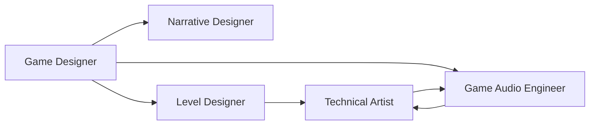
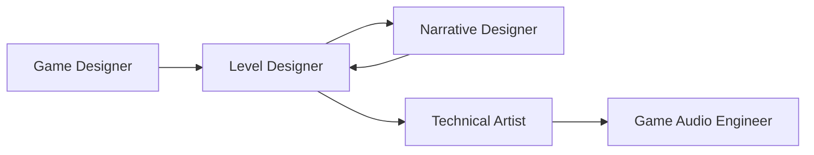
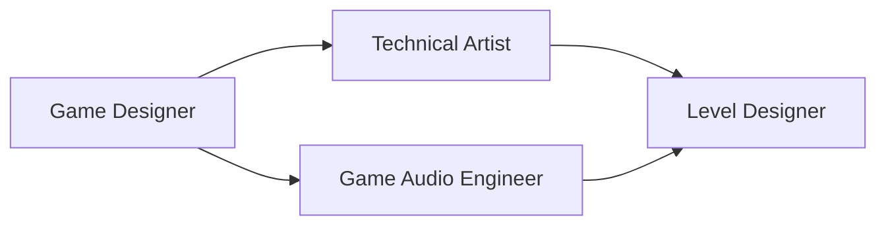

[根目录](../CLAUDE.md) > **game-development**

---

# Game Development Agents - AI Context Documentation

> **Category**: Game Development
> **Agent Count**: 5
> **Last Updated**: 2026-03-16

## 📋 Breadcrumb Navigation

[根目录](../CLAUDE.md) > **game-development**

---

## Module Overview

The Game Development category contains **5 specialized agents** covering the creative and technical disciplines essential to game production: systems design, level architecture, narrative design, audio engineering, and technical art. These agents work in concert to transform creative vision into implemented, performant game experiences.

### Core Philosophy

Game development agents are designed to be:
- **Player-Experience Focused**: Every decision serves the player's emotional journey and gameplay satisfaction
- **Cross-Disciplinary**: Bridge creative vision with technical constraints and performance realities
- **Documentation-Driven**: Rigorous specification that prevents implementation ambiguity
- **Performance-Conscious**: Visual and auditory excellence within hard frame budget constraints

---

## Agent Inventory

### Design & Systems (2 agents)

| Agent | Specialty | Key Expertise |
|-------|-----------|---------------|
| **Game Designer** | Systems architecture, mechanics design, economy balancing | GDD authorship, player psychology, gameplay loops, progression curves |
| **Level Designer** | Spatial architecture, pacing, encounter design, environmental narrative | Flow theory, blockout discipline, combat encounter tuning, readability |

### Narrative & Audio (2 agents)

| Agent | Specialty | Key Expertise |
|-------|-----------|---------------|
| **Narrative Designer** | Story systems, dialogue, branching narrative, lore architecture | Character voice, choice architecture, environmental storytelling, narrative-gameplay integration |
| **Game Audio Engineer** | Interactive audio systems, adaptive music, spatial audio, middleware integration | FMOD/Wwise, audio budgeting, parameter-driven sound, occlusion/reverb systems |

### Technical Art (1 agent)

| Agent | Specialty | Key Expertise |
|-------|-----------|---------------|
| **Technical Artist** | Art-to-engine pipeline, shaders, VFX systems, performance optimization | HLSL/shader programming, LOD pipelines, asset budgets, GPU profiling, VFX tuning |

---

## Key Interfaces & Workflows

### Common Development Patterns

#### Full Game Production Workflow



**Agent Collaboration**:
1. **Game Designer**: Authors core systems, mechanics, and gameplay loop specifications
2. **Narrative Designer**: Aligns story structure with gameplay pillars, designs branching systems
3. **Level Designer**: Creates spatial architecture that teaches mechanics and delivers narrative beats
4. **Technical Artist**: Defines asset budgets, builds shaders/VFX, ensures visual quality within performance constraints
5. **Game Audio Engineer**: Implements adaptive music, spatial audio, and sound systems that respond to gameplay state

#### Level Creation Pipeline



**Agent Sequence**:
1. **Game Designer**: Defines level's gameplay intent, pacing arc, and encounter requirements
2. **Level Designer**: Authors blockout layout, places encounters, designs flow and affordances
3. **Narrative Designer**: Integrates environmental storytelling, dialogue placement, and narrative beats
4. **Technical Artist**: Reviews blockout for performance, defines lighting, prepares art handoff specs
5. **Game Audio Engineer**: Implements ambient zones, encounter audio, and spatial audio parameters

#### Feature Implementation Workflow



**Agent Sequence**:
1. **Game Designer**: Specifications new feature/mechanic with player experience goals
2. **Technical Artist**: Creates shaders/VFX needed for feature, establishes asset budget
3. **Game Audio Engineer**: Designs audio feedback systems and adaptive parameters
4. **Level Designer**: Integrates feature into level geometry, designs tutorial/onboarding flow

---

## Technical Deliverables

### Game Designer Output Example

```markdown
# Core Loop: [Game Title]

## Moment-to-Moment (0–30 seconds)
- **Action**: Player performs [core verb]
- **Feedback**: Immediate [visual/audio/haptic] response
- **Reward**: [Resource/progression/intrinsic satisfaction]

## Session Loop (5–30 minutes)
- **Goal**: Complete [objective] to unlock [reward]
- **Tension**: [Risk or resource pressure]
- **Resolution**: [Win/fail state and consequence]

## Economy Balance Spreadsheet
Variable          | Base Value | Min | Max | Tuning Notes
------------------|------------|-----|-----|-------------------
Player HP         | 100        | 50  | 200 | Scales with level
Enemy Damage      | 15         | 5   | 40  | [PLACEHOLDER] - test at level 5
Resource Drop %   | 0.25       | 0.1 | 0.6 | Adjust per difficulty
```

### Level Designer Output Example

```markdown
# Level: [Name/ID]

## Intent
**Player Fantasy**: What the player should feel in this level
**Pacing Arc**: Tension → Release → Escalation → Climax → Resolution
**New Mechanic Introduced**: How is it taught spatially?

## Encounter List
| ID  | Type     | Enemy Count | Tactical Options | Fallback Position |
|-----|----------|-------------|------------------|-------------------|
| E01 | Ambush   | 4           | Flank / Suppress | Door archway      |
| E02 | Arena    | 8           | 3 cover positions| Elevated platform |

## Flow Diagram
[Entry] → [Tutorial beat] → [First encounter] → [Exploration fork]
                                                ↓           ↓
                                       [Optional loot]  [Critical path]
                                                ↓           ↓
                                           [Merge] → [Boss/Exit]
```

### Technical Artist Output Example

```markdown
# Asset Technical Budgets — [Project Name]

## Characters
| LOD  | Max Tris | Texture Res | Draw Calls |
|------|----------|-------------|------------|
| LOD0 | 15,000   | 2048×2048   | 2–3        |
| LOD1 | 8,000    | 1024×1024   | 2          |
| LOD2 | 3,000    | 512×512     | 1          |
| LOD3 | 800      | 256×256     | 1          |

## VFX Particles
- Max simultaneous particles on screen: 500 (mobile) / 2000 (PC)
- Max overdraw layers per effect: 3 (mobile) / 6 (PC)
```

### Game Audio Engineer Output Example

```csharp
public class AudioManager : MonoBehaviour
{
    public static AudioManager Instance { get; private set; }

    [SerializeField] private FMODUnity.EventReference _footstepEvent;
    [SerializeField] private FMODUnity.EventReference _musicEvent;

    private FMOD.Studio.EventInstance _musicInstance;

    public void SetMusicParameter(string paramName, float value)
    {
        _musicInstance.setParameterByName(paramName, value);
    }

    public void StopMusic(bool fadeOut = true)
    {
        _musicInstance.stop(fadeOut
            ? FMOD.Studio.STOP_MODE.ALLOWFADEOUT
            : FMOD.Studio.STOP_MODE.IMMEDIATE);
        _musicInstance.release();
    }
}
```

### Narrative Designer Output Example

```
// Scene: First meeting with Commander Reyes
REYES: "You're late."
-> [Choice: How does the player respond?]
    + "I had complications." [Pragmatic]
        REYES: "Everyone does. The ones who survive learn to plan for them."
        -> reyes_neutral
    + "Your intel was wrong." [Challenging]
        REYES: "Then you improvised. Good. We need people who can."
        -> reyes_impressed
    + [Stay silent.] [Observing]
        REYES: "(Studies you.) Interesting. Follow me."
        -> reyes_intrigued
```

---

## Dependencies & Integrations

### Game Engine Compatibility

All game development agents are engine-agnostic but reference:
- **Unity**: C# scripting, Unity Physics, Universal Render Pipeline (URP)
- **Unreal Engine**: Blueprints, C++, Niagara VFX, Chaos Physics
- **Godot**: GDScript, Godot Physics, Visual Shader nodes

### Middleware & Tools

- **Audio Middleware**: FMOD Studio, Wwise, native engine audio systems
- **Dialogue Tools**: Ink, Yarn Spinner, Twine, custom dialogue systems
- **DCC Tools**: Blender, Maya, 3ds Max, Substance Painter, Houdini
- **Version Control**: Git (Git LFS for large assets), Perforce for AAA pipelines

### Integration Patterns

```bash
# Convert game-development agents for different tools
./scripts/convert.sh --tool cursor     # .cursor/rules/*.mdc
./scripts/convert.sh --tool opencode   # .opencode/agents/*.md
./scripts/convert.sh --tool qwen       # .qwen/agents/*.md
```

---

## Testing & Quality Assurance

### Quality Standards for Game Development Agents

- ✅ **Design Documentation**: All mechanics documented with purpose, inputs, outputs, edge cases
- ✅ **Performance Budgets**: Asset budgets defined before production begins, enforced at import
- ✅ **Player-First Thinking**: Every design decision justified by player experience goal
- ✅ **Cross-Discipline Communication**: Specs clear enough for artists/engineers to implement without ambiguity
- ✅ **Playtest-Driven**: All design decisions grounded in observed player behavior, not assumptions

### Success Metrics

Game development agents should deliver:
- **Game Design Documents (GDD)**: Complete specifications with no ambiguous fields
- **Level Blockouts**: Grey-box layouts validated by playtest before art production
- **Asset Budget Sheets**: Per-asset-type technical specifications (poly count, textures, LODs)
- **Dialogue Systems**: Branching narrative with convergence points and consequence tracking
- **Audio Integration**: Middleware event structures with parameter-driven adaptive systems

---

## Common Workflows

### 1. Feature Design Workflow

```
Game Designer → Technical Artist → Game Audio Engineer → Level Designer
```

**Steps**:
1. Define feature and player experience goals (Game Designer)
2. Create shaders/VFX and asset budgets (Technical Artist)
3. Design audio feedback and parameter systems (Game Audio Engineer)
4. Integrate into level with tutorial/onboarding (Level Designer)

### 2. Level Production Workflow

```
Game Designer → Level Designer → Narrative Designer → Technical Artist → Game Audio Engineer
```

**Steps**:
1. Define level intent and pacing arc (Game Designer)
2. Create blockout layout and encounters (Level Designer)
3. Integrate environmental storytelling (Narrative Designer)
4. Review performance and prepare art handoff (Technical Artist)
5. Implement ambient and encounter audio (Game Audio Engineer)

### 3. Narrative Integration Workflow

```
Narrative Designer → Game Designer → Level Designer → Game Audio Engineer
```

**Steps**:
1. Design branching story and character voices (Narrative Designer)
2. Align story beats with gameplay systems (Game Designer)
3. Integrate environmental narrative into level layout (Level Designer)
4. Implement dialogue audio and voice parameter systems (Game Audio Engineer)

### 4. Audio Production Workflow

```
Game Designer → Game Audio Engineer → Technical Artist
```

**Steps**:
1. Define gameplay states that require audio response (Game Designer)
2. Design adaptive music and SFX systems (Game Audio Engineer)
3. Profile audio performance and coordinate with rendering budget (Technical Artist)

---

## FAQ

**Q: What's the difference between Game Designer and Level Designer?**
A: Game Designer focuses on systems, mechanics, and overall game rules that apply across the entire game. Level Designer specializes in spatial architecture, pacing, and encounter design within individual levels.

**Q: How do Technical Artist and Game Audio Engineer collaborate?**
A: Technical Artist manages visual performance budget (GPU), Game Audio Engineer manages audio performance budget (CPU/memory). They coordinate to ensure total frame time isn't exceeded — expensive VFX may require simpler audio, and vice versa.

**Q: When should I use Narrative Designer vs. just writing dialogue?**
A: Narrative Designer designs story systems, branching architecture, and character voice consistency. They're essential for any game with meaningful player choices, complex characters, or environmental storytelling.

**Q: Do these agents work with engineering agents?**
A: Absolutely! Game development agents define creative and technical specifications; engineering agents (Backend Architect, Frontend Developer, etc.) implement the core systems. The workflow is typically: Game Design → Technical Art → Engineering Implementation.

**Q: Are these agents engine-specific?**
A: No, all game development agents are engine-agnostic and reference Unity, Unreal, and Godot best practices. They can be adapted to any game engine or proprietary technology.

---

## Related Files

- **[CLAUDE.md](../CLAUDE.md)** - Root documentation
- **[CONTRIBUTING.md](../CONTRIBUTING.md)** - Contribution guidelines
- **[scripts/convert.sh](../scripts/convert.sh)** - Conversion pipeline
- **[scripts/install.sh](../scripts/install.sh)** - Installation script

### Category Documentation

- **[engineering/CLAUDE.md](../engineering/CLAUDE.md)** - Engineering agents (software development, DevOps, security)
- **[creative/CLAUDE.md](../creative/CLAUDE.md)** - Creative agents (writing, art, design)
- **[data-science/CLAUDE.md](../data-science/CLAUDE.md)** - Data science agents (ML, analytics, research)

---

## Changelog

### 2026-03-16 - Category Documentation Created
- 📊 **Agent Inventory**: Cataloged all 5 game development agents
- ✨ **Workflow Diagrams**: Added game production and level creation workflows
- 📋 **Technical Deliverables**: Included GDD templates, blockout specs, asset budgets, and code examples
- 🔗 **Integration Guide**: Documented engine compatibility and middleware integration
- ✅ **Quality Standards**: Defined success metrics and documentation requirements
- 🔄 **Cross-Category Workflows**: Mapped collaboration patterns with engineering agents

---

<div align="center">

**Game Development Agents** - Your Game Production Team

5 Specialists • Full Pipeline • Player-Experience Focused

</div>
