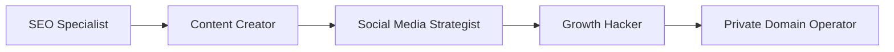
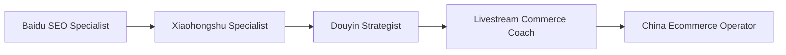
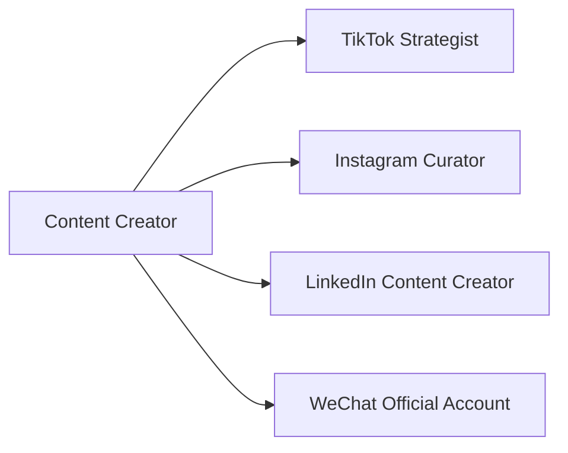

[根目录](../CLAUDE.md) > **marketing**

---

# Marketing Agents - AI Context Documentation

> **Category**: Marketing
> **Agent Count**: 27
> **Last Updated**: 2026-03-16

## 📋 Breadcrumb Navigation

[根目录](../CLAUDE.md) > **marketing**

---

## Module Overview

The Marketing category contains **27 specialized agents** covering the complete digital marketing landscape, from SEO and social media to content creation, ecommerce, and platform-specific strategies across global markets (Western platforms like TikTok, Instagram, LinkedIn) and Chinese digital ecosystems (WeChat, Douyin, Xiaohongshu, Zhihu, and more).

### Core Philosophy

Marketing agents are designed to be:
- **Platform-Native**: Deep expertise in specific platform algorithms, cultures, and best practices
- **Data-Driven**: Decisions based on metrics, analytics, and performance measurement
- **Growth-Focused**: Strategies that drive measurable business outcomes (traffic, engagement, conversions)
- **Culturally Authentic**: Content and approaches that resonate with target audiences on their preferred platforms

---

## Agent Inventory

### SEO & Search Marketing (3 agents)

| Agent | Specialty | Key Platforms/Focus |
|-------|-----------|---------------------|
| **SEO Specialist** | Technical SEO, content optimization, link building, organic search growth | Google, Bing, Core Web Vitals, SERP features |
| **AI Citation Strategist** | AEO/GEO optimization, AI search visibility, entity authority building | AI-powered search, knowledge graphs, citations |
| **Baidu SEO Specialist** | Chinese search engine optimization for Baidu ecosystem | Baidu, Chinese SEO, mobile-first indexing |

### Social Media Strategy (7 agents)

| Agent | Specialty | Key Platforms |
|-------|-----------|---------------|
| **Social Media Strategist** | Cross-platform strategy, LinkedIn, Twitter, professional networks | LinkedIn, Twitter, professional platforms |
| **TikTok Strategist** | Viral content, algorithm optimization, Gen Z engagement | TikTok, short-form video |
| **Instagram Curator** | Visual storytelling, influencer partnerships, aesthetic branding | Instagram, IG Reels, Stories |
| **Twitter Engager** | Real-time engagement, trend hijacking, community building | Twitter/X, hashtags |
| **Reddit Community Builder** | Community management, authentic engagement, subreddit growth | Reddit, AMAs, community moderation |
| **Weibo Strategist** | Chinese microblogging, celebrity partnerships, viral campaigns | Weibo, Chinese social media |
| **LinkedIn Content Creator** | B2B thought leadership, professional branding, employee advocacy | LinkedIn, articles, newsletters |

### Content Creation & Strategy (4 agents)

| Agent | Specialty | Content Types |
|-------|-----------|---------------|
| **Content Creator** | Multi-platform content strategy, brand storytelling, editorial calendars | Blogs, video, podcasts, social media |
| **Book Co-Author** | Long-form content, book collaboration, thought leadership development | Books, ebooks, whitepapers |
| **Podcast Strategist** | Audio content planning, guest booking, audience growth | Podcasts, audio content, interviews |
| **Short Video Editing Coach** | Video production guidance, editing workflows, platform optimization | Short-form video, TikTok/Reels/Shorts |

### Chinese Platform Specialists (5 agents)

| Agent | Specialty | Platform Focus |
|-------|-----------|----------------|
| **Douyin Strategist** | TikTok China strategy, Chinese short video, local trends | Douyin (Chinese TikTok) |
| **Xiaohongshu Specialist** | Lifestyle content, product reviews, female demographic | Xiaohongshu (Little Red Book) |
| **Zhihu Strategist** | Q&A content, thought leadership, expert positioning | Zhihu (Chinese Quora) |
| **Kuaishou Strategist** | Lower-tier city markets, authentic content, community building | Kuaishou (short video) |
| **WeChat Official Account** | Subscriber engagement, content marketing, Mini Program integration | WeChat OA, articles, automation |

### Ecommerce & Growth Marketing (5 agents)

| Agent | Specialty | Key Capabilities |
|-------|-----------|------------------|
| **China Ecommerce Operator** | Tmall, Taobao, JD operations, Chinese marketplace optimization | Tmall, Taobao, JD.com |
| **Cross-Border Ecommerce** | International expansion, localization, global logistics | Amazon, cross-border trade |
| **Livestream Commerce Coach** | Live selling, host training, real-time conversion optimization | Douyin Live, Taobao Live, Kuaishou |
| **Growth Hacker** | Rapid experimentation, viral loops, funnel optimization | A/B testing, analytics, growth experiments |
| **Private Domain Operator** | Customer retention, WeChat groups, CRM integration | Private traffic, customer lifetime value |

### Specialized Marketing (3 agents)

| Agent | Specialty | Focus Area |
|-------|-----------|------------|
| **App Store Optimizer** | ASO, app visibility, conversion rate optimization | Apple App Store, Google Play |
| **Carousel Growth Engine** | Interactive content, engagement optimization, swipeable formats | Social media carousels, interactive posts |
| **Bilibili Content Strategist** | Video content, youth culture, bullet comments | Bilibili (Chinese YouTube) |

---

## Key Interfaces & Workflows

### Common Marketing Patterns

#### Full-Funnel Marketing Campaign



**Agent Sequence**:
1. **SEO Specialist**: Research keywords and optimize content for organic discoverability
2. **Content Creator**: Develop compelling content that ranks and engages
3. **Social Media Strategist**: Distribute content across relevant platforms
4. **Growth Hacker**: Optimize conversion funnels and run growth experiments
5. **Private Domain Operator**: Retain customers and build lifetime value

#### Chinese Market Entry Workflow



**Agent Sequence**:
1. **Baidu SEO Specialist**: Optimize for Chinese search engine visibility
2. **Xiaohongshu Specialist**: Build brand awareness through lifestyle content
3. **Douyin Strategist**: Create viral short-form video content
4. **Livestream Commerce Coach**: Launch live commerce campaigns for conversions
5. **China Ecommerce Operator**: Manage Tmall/Taobao/JD store operations

#### Cross-Platform Content Strategy



**Agent Sequence**:
1. **Content Creator**: Develop core content strategy and brand messaging
2. **TikTok Strategist**: Adapt content for TikTok with viral optimization
3. **Instagram Curator**: Transform content for Instagram's visual-first approach
4. **LinkedIn Content Creator**: Professionalize content for B2B audiences
5. **WeChat Official Account**: Localize for Chinese market subscriber engagement

---

## Technical Deliverables

### SEO Specialist Output Example

```markdown
# Technical SEO Audit Report

## Crawlability & Indexation
### Robots.txt Analysis
- Allowed paths: /products/, /blog/, /about/
- Blocked paths: /admin/, /api/, /cart/
- Sitemap reference: https://example.com/sitemap.xml (verified)

### XML Sitemap Health
- Total URLs in sitemap: 2,450
- Indexed URLs (via Search Console): 2,180
- Index coverage ratio: 2,180/2,450 = 89%
- Issues: 12 orphaned pages, 3 404s in sitemap

## Core Web Vitals (Field Data)
| Metric | Mobile | Desktop | Target | Status |
|--------|--------|---------|--------|--------|
| LCP    | 2.1s   | 1.8s    | <2.5s  | ✅     |
| INP    | 180ms  | 150ms   | <200ms | ✅     |
| CLS    | 0.05   | 0.02    | <0.1   | ✅     |

## Keyword Research & Content Gaps
### High-Priority Opportunities
| Keyword | Volume | KD | Current Position | Opportunity |
|---------|--------|----|------------------|-------------|
| [keyword 1] | 12,500 | 45 | Position 8 | Featured snippet weak |
| [keyword 2] | 8,200 | 38 | Position 12 | Low competition |
| [keyword 3] | 5,400 | 28 | Not ranking | Competitor content gap |
```

### TikTok Strategist Output Example

```markdown
# TikTok Content Strategy

## Content Pillars (40/30/20/10 Mix)
- **Educational (40%)**: Tips, tutorials, industry insights
- **Entertainment (30%)**: Trends, challenges, humor
- **Inspirational (20%)**: Behind-the-scenes, success stories
- **Promotional (10%)**: Product launches, offers

## Viral Content Framework
### Hook Structure (First 3 Seconds)
1. **Pattern Interrupt**: Visual surprise or unexpected statement
2. **Pain Point Callout**: "Anyone else struggling with [problem]?"
3. **Value Tease**: "Here's what nobody tells you about [topic]"

### Trend Integration Strategy
- **Monday**: Trending sound + product demo
- **Wednesday**: Original audio + educational content
- **Friday**: User-generated content compilation + trending hashtag

## Performance Targets
- Engagement Rate: 8%+ (industry avg: 5.96%)
- View Completion: 70%+ for branded content
- Follower Growth: 15% monthly
- Hashtag Challenge: 1M+ views for branded campaigns
```

### Livestream Commerce Coach Output Example

```markdown
# Livestream Script Template

## Product Walkthrough (5 minutes)

### Minute 1: Retention + Pain Point
"Don't scroll! This product sold out instantly last time.
Anyone here dealing with [pain point]? Type 1 if yes!"

### Minutes 2-3: Product + Trust
"Look at this [product] - made with [materials/craftsmanship].
The difference? [Key differentiator 1] and [differentiator 2].
I've used it for [time], and honestly [personal experience]."

### Minute 4: Price Reveal + Urgency
"Retail: ¥XXX. Today only - [gifts included].
That's ¥XX in gifts alone! Our livestream price? ¥XXX!
Only [quantity] units! 3, 2, 1 - link is up!"

### Minute 5: Follow-Up
"Got it? Type 'got it'! Missed out? Let me release [X] more!"

## Live Room KPIs
- Average Watch Time: >60s
- Engagement Rate: >5%
- GPM (GMV per 1K views): >¥800
- Organic Traffic Share: >50% (mature phase)
```

---

## Dependencies & Integrations

### Platform Dependencies

Marketing agents integrate with various platforms and tools:

**SEO & Analytics**:
- Google Search Console, Google Analytics, SEMrush, Ahrefs
- Baidu Webmaster Tools, Baidu Analytics
- Screaming Frog, Sitebulb (technical SEO)

**Social Media Management**:
- Hootsuite, Buffer, Sprout Social
- Platform native tools (TikTok Business Suite, WeChat OA Backend)
- Social listening tools (Brandwatch, Mention)

**Content Creation**:
- Canva, Adobe Creative Cloud, Figma
- Video editing tools (CapCut, Premiere, Final Cut)
- AI writing assistants (Copy.ai, Jasper)

**Ecommerce & Live Commerce**:
- Tmall/JD merchant platforms, Douyin Shop
- Qianchuan (Ocean Engine) advertising platform
- Livestream tools (Douyin Live Studio, Taobao Live)

### Conversion Pipeline

```bash
# Convert marketing agents for different platforms
./scripts/convert.sh --tool cursor     # .cursor/rules/*.mdc
./scripts/convert.sh --tool opencode   # .opencode/agents/*.md
./scripts/convert.sh --tool qwen       # .qwen/agents/*.md
```

---

## Testing & Quality Assurance

### Quality Standards for Marketing Agents

- ✅ **Platform Expertise**: Deep knowledge of platform algorithms and best practices
- ✅ **Data-Driven**: All strategies backed by metrics and analytics
- ✅ **Cultural Authenticity**: Content that resonates with target audiences
- ✅ **Compliance**: Adherence to platform guidelines and advertising regulations
- ✅ **Measurable Results**: Clear KPIs and success metrics for all campaigns
- ✅ **Adaptability**: Stay current with platform changes and trending strategies

### Success Metrics

Marketing agents should deliver:
- **Growth**: Measurable increases in followers, traffic, engagement, or conversions
- **ROI**: Positive return on marketing investment and advertising spend
- **Brand Awareness**: Increased share of voice and brand mention volume
- **Customer Acquisition**: Cost-effective lead generation and customer acquisition
- **Retention**: Improved customer lifetime value and retention rates

---

## Common Workflows

### 1. Product Launch Campaign

```
SEO Specialist → Content Creator → Social Media Strategist → TikTok/Instagram Specialists → Growth Hacker → Private Domain Operator
```

**Steps**:
1. Optimize landing pages for search (SEO Specialist)
2. Create launch content and messaging (Content Creator)
3. Plan cross-platform campaign calendar (Social Media Strategist)
4. Execute platform-specific content (TikTok/Instagram specialists)
5. Run growth experiments and optimize (Growth Hacker)
6. Capture and retain customers (Private Domain Operator)

### 2. Chinese Market Entry

```
Baidu SEO → Xiaohongshu Specialist → Douyin Strategist → Zhihu Strategist → Livestream Commerce Coach → China Ecommerce Operator
```

**Steps**:
1. Build search presence on Baidu (Baidu SEO)
2. Create brand awareness on Xiaohongshu (Xiaohongshu Specialist)
3. Launch viral content on Douyin (Douyin Strategist)
4. Establish thought leadership on Zhihu (Zhihu Strategist)
5. Run livestream commerce campaigns (Livestream Commerce Coach)
6. Set up and optimize Tmall/JD stores (China Ecommerce Operator)

### 3. Content Repurposing Strategy

```
Book Co-Author → Content Creator → Podcast Strategist → LinkedIn Content Creator → WeChat Official Account
```

**Steps**:
1. Develop long-form content framework (Book Co-Author)
2. Create derivative content pieces (Content Creator)
3. Produce audio/podcast versions (Podcast Strategist)
4. Adapt for professional audiences (LinkedIn Content Creator)
5. Localize for Chinese market (WeChat Official Account)

---

## FAQ

**Q: What's the difference between TikTok Strategist and Douyin Strategist?**
A: TikTok Strategist focuses on the global TikTok platform with Western audience trends and viral mechanics. Douyin Strategist specializes in the Chinese version (Douyin) with unique Chinese market trends, e-commerce integration, and local platform features like Douyin Shop and different algorithm behaviors.

**Q: When should I use Content Creator vs. platform-specific specialists?**
A: Use Content Creator for overall content strategy, editorial calendars, and brand messaging. Use platform-specific specialists (TikTok Strategist, Instagram Curator, etc.) when you need content optimized for specific platforms with their unique algorithms, formats, and audience behaviors.

**Q: Do these agents work together for integrated campaigns?**
A: Absolutely! Marketing agents are designed for collaboration. See the Common Workflows section for examples of multi-agent campaigns like product launches, market entry, and content repurposing.

**Q: What's the difference between Growth Hacker and other marketing agents?**
A: Growth Hacker focuses specifically on rapid experimentation, viral mechanics, and scalable growth tactics. Other marketing agents may specialize in platforms or content types, while Growth Hacker provides the experimentation framework and funnel optimization to accelerate growth across all channels.

**Q: Can I use Chinese platform specialists for Western markets?**
A: Chinese platform specialists (Xiaohongshu, Douyin, Zhihu, etc.) are specifically designed for Chinese digital ecosystems. For Western markets, use the corresponding global platform specialists (Instagram, TikTok, LinkedIn, etc.).

---

## Related Files

- **[CLAUDE.md](../CLAUDE.md)** - Root documentation
- **[CONTRIBUTING.md](../CONTRIBUTING.md)** - Contribution guidelines
- **[scripts/convert.sh](../scripts/convert.sh)** - Conversion pipeline
- **[scripts/install.sh](../scripts/install.sh)** - Installation script

---

## Changelog

### 2026-03-16 - Category Documentation Created
- 📊 **Agent Inventory**: Cataloged all 27 marketing agents across 6 specializations
- ✨ **Workflow Diagrams**: Added marketing campaign and market entry workflows
- 📋 **Technical Deliverables**: Included SEO audit, TikTok strategy, and livestream script examples
- 🔗 **Integration Guide**: Documented platform dependencies and tool compatibility
- ✅ **Quality Standards**: Defined success metrics and quality assurance frameworks
- 🌏 **Market Coverage**: Documented both Western and Chinese platform ecosystem coverage

---

<div align="center">

**Marketing Agents** - Your Digital Marketing Team

27 Specialists • Global Platforms • Measurable Growth

</div>
