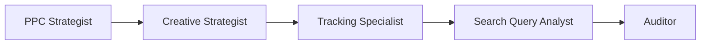
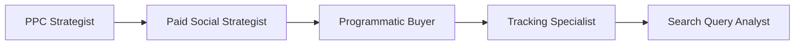
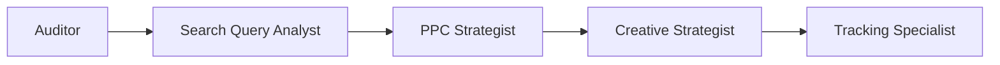

[根目录](../CLAUDE.md) > **paid-media**

---

# Paid Media Agents - AI Context Documentation

> **Category**: Paid Media
> **Agent Count**: 7
> **Last Updated**: 2026-03-16 10:06:00 UTC

## 📋 Breadcrumb Navigation

[根目录](../CLAUDE.md) > **paid-media**

---

## Module Overview

The Paid Media category contains **7 specialized agents** covering the complete paid advertising ecosystem, from search and social campaigns to programmatic buying, creative strategy, tracking implementation, and comprehensive auditing. These agents work together to design, execute, optimize, and measure paid media programs across Google Ads, Microsoft Advertising, Meta (Facebook/Instagram), LinkedIn, TikTok, and programmatic platforms.

### Core Philosophy

Paid media agents are designed to be:
- **Performance-Driven**: Every dollar tracked toward ROAS/CPA targets with full attribution
- **Platform-Expert**: Deep specialization in each ad platform's unique mechanics and best practices
- **Data-Fundamental**: Tracking accuracy and measurement integrity as the foundation for all optimization
- **Scale-Ready**: Architectures that grow from $10K to $10M+ monthly spend without breaking

---

## Agent Inventory

### Strategy & Planning (3 agents)

| Agent | Specialty | Key Platforms |
|-------|-----------|---------------|
| **PPC Campaign Strategist** | Search, shopping, Performance Max architecture | Google Ads, Microsoft Ads, Amazon Ads |
| **Paid Social Strategist** | Full-funnel social advertising | Meta, LinkedIn, TikTok, Pinterest, X, Snapchat |
| **Programmatic Buyer** | Display, programmatic, partner media | GDN, DV360, Trade Desk, Demandbase, 6Sense |

### Execution & Optimization (2 agents)

| Agent | Specialty | Key Capabilities |
|-------|-----------|------------------|
| **Ad Creative Strategist** | Ad copywriting, creative testing, asset optimization | RSA architecture, Meta creative, Performance Max assets |
| **Search Query Analyst** | Query mining, negative keyword architecture, waste elimination | Search term analysis, intent classification, query sculpting |

### Technical & Measurement (2 agents)

| Agent | Specialty | Key Technologies |
|-------|-----------|------------------|
| **Tracking & Measurement Specialist** | Conversion tracking, GTM, GA4, attribution modeling | GTM, GA4, CAPI, enhanced conversions, server-side tagging |
| **Paid Media Auditor** | Comprehensive account audits across 200+ checkpoints | Multi-platform audit frameworks, competitive analysis |

---

## Key Interfaces & Workflows

### Common Paid Media Patterns

#### Full-Funnel Campaign Launch Workflow



**Agent Sequence**:
1. **PPC Strategist**: Design campaign architecture, budget allocation, bidding strategy
2. **Creative Strategist**: Develop ad copy, creative assets, testing framework
3. **Tracking Specialist**: Implement conversion tracking, GA4 events, attribution setup
4. **Search Query Analyst**: Monitor search terms, build negative keyword lists, optimize queries
5. **Auditor**: Conduct post-launch audit, identify optimization opportunities

#### Cross-Platform Campaign Workflow



**Agent Sequence**:
1. **PPC Strategist**: Plan search and shopping campaigns as foundation
2. **Paid Social Strategist**: Layer on social prospecting and retargeting
3. **Programmatic Buyer**: Add display and programmatic for upper-funnel reach
4. **Tracking Specialist**: Ensure cross-platform tracking and attribution
5. **Search Query Analyst**: Optimize search queries based on cross-channel learnings

#### Account Audit & Optimization Workflow



**Agent Sequence**:
1. **Auditor**: Conduct comprehensive 200+ checkpoint audit
2. **Search Query Analyst**: Analyze search terms, identify waste
3. **PPC Strategist**: Restructure campaigns based on audit findings
4. **Creative Strategist**: Refresh underperforming ad creative
5. **Tracking Specialist**: Fix any tracking or measurement issues

---

## Technical Deliverables

### PPC Campaign Architecture Example

```markdown
# Account Architecture: E-commerce Retailer

## Campaign Structure
### Tier 1: Brand Protection
- **Campaign**: Brand Core
  - Match Types: Exact, Phrase
  - Bidding: Maximize Clicks (with CPC cap)
  - Budget: $2,000/month
  - Target: Search Network

### Tier 2: High-Intent Non-Brand
- **Campaign**: Product Category - Transactional
  - Match Types: Phrase, Broad (with smart bidding)
  - Bidding: Target ROAS (400%)
  - Budget: $15,000/month
  - Target: Search + Shopping

### Tier 3: Competitor Conquest
- **Campaign**: Competitor Terms
  - Match Types: Phrase, Exact
  - Bidding: Maximize Conversions (with tCPA floor)
  - Budget: $5,000/month
  - Target: Search Network

### Tier 4: Performance Max
- **Campaign**: PMax - All Products
  - Asset Groups: 5 (by product category)
  - Bidding: Maximize Conversion Value
  - Budget: $8,000/month
  - Signals: Customer match, page feeds

## Budget Allocation Framework
- **Brand**: 10% ($2K) - defensive, maintain impression share
- **Non-Brand**: 50% ($15K) - growth, optimize for ROAS
- **Competitor**: 15% ($5K) - conquest, efficiency focus
- **Performance Max**: 25% ($8K) - discovery, new customer acquisition

## Bidding Strategy Matrix
| Campaign Type | Volume | Strategy | Target |
|--------------|--------|----------|---------|
| Brand Exact | High | Maximize Clicks | CPC cap $2.50 |
| Non-Brand | High | Target ROAS | 400% |
| Competitor | Medium | Max Conversions | tCPA $45 |
| PMax | Medium | Max Conv Value | No cap |

## Negative Keyword Architecture
- **Account-Level Negatives**: 150 terms (irrelevant categories, competitors)
- **Campaign-Level Negatives**: Per-theme exclusions
- **Ad Group-Level Negatives**: Query-specific exclusions

## Conversion Action Hierarchy
1. **Primary**: Purchase (ecommerce)
2. **Secondary**: Add to Cart, Begin Checkout
3. **Micro**: View Content, Site Search

## Tracking & Measurement
- **GA4 Events**: purchase, add_to_cart, begin_checkout, view_item
- **Enhanced Conversions**: Email, phone (web)
- **Offline Import**: CRM revenue match via GCLID
- **Attribution**: Data-driven (60-day window)
```

### Creative Testing Framework Example

```markdown
# Creative Testing Plan: RSA Refresh

## Test Hypothesis
Benefit-focused headlines will outperform feature-focused headlines for high-consideration products.

## Test Design
- **Format**: Responsive Search Ads (RSA)
- **Variables**: Headline categories (benefit vs feature)
- **Duration**: 4 weeks or 5,000 impressions per ad
- **Success Metric**: CTR improvement >15%, CPA maintenance

## RSA Architecture (15 Headlines)
### Benefit Headlines (5)
1. Save 30% on Energy Bills
2. Free Shipping Orders $50+
3. 30-Day Money Back Guarantee
4. Certified by Energy Star
5. Lifetime Support Included

### Feature Headlines (5)
1. 5000mAh Battery Capacity
2. Wireless Charging Compatible
3. IP68 Water Resistant
4. Fast Charge 0-100% in 30min
5. USB-C & Lightning Ports

### Brand/CTA Headlines (5)
1. Shop [Brand Name] Today
2. Limited Time Offer
3. Order Now - Free Ship
4. Best-Selling Solar Power
5. Award-Winning Design

## Pinning Strategy
- **Pinned Position 1**: Brand/CTA headlines
- **Pinned Position 2**: Benefit headlines
- **Rotating Positions 3-15**: All headlines for rotation

## Success Criteria
- **CTR**: >3.5% (baseline: 3.0%)
- **CPA**: <$45 (baseline: $47)
- **Ad Strength**: "Good" or "Excellent"
- **Statistical Significance**: 95% confidence

## Testing Timeline
- **Week 1-2**: Run test, collect data
- **Week 3**: Statistical analysis
- **Week 4**: Roll out winners or iterate

## Measurement Plan
- **Daily Monitoring**: Impression share, avg position
- **Weekly Reporting**: CTR by headline position, conversion rate
- **Post-Test Analysis**: Confidence intervals, winner selection
```

---

## Dependencies & Integrations

### Platform Dependencies

Paid media agents integrate with major advertising platforms:

- **Google Ads**: Search, Shopping, Performance Max, Display, YouTube, Discover
- **Microsoft Advertising**: Search, Shopping, Audience ads (LinkedIn integration)
- **Meta Ads**: Facebook, Instagram, Messenger, Audience Network
- **LinkedIn Ads**: Sponsored content, message ads, document ads
- **TikTok Ads**: In-feed, Spark Ads, TopView
- **Amazon Ads**: Sponsored Products, Brands, Display
- **Programmatic DSPs**: DV360, Trade Desk, Amazon DSP

### Measurement & Analytics

- **Google Analytics 4**: Event tracking, conversion modeling, attribution
- **Google Tag Manager**: Tag management, triggers, variables, dataLayer
- **Meta Pixel**: Standard events, custom events, CAPI
- **LinkedIn Insight Tag**: Website demographics, conversion tracking
- **Server-Side Tracking**: GTM SGA, CAPI, enhanced conversions

### Integration Patterns

```bash
# Convert paid media agents for different tools
./scripts/convert.sh --tool cursor     # .cursor/rules/*.mdc
./scripts/convert.sh --tool opencode   # .opencode/agents/*.md
./scripts/convert.sh --tool qwen       # .qwen/agents/*.md
```

---

## Common Workflows

### 1. New Campaign Launch

```
PPC Strategist → Creative Strategist → Tracking Specialist → Search Query Analyst → Auditor
```

**Steps**:
1. Design campaign architecture and budget allocation (PPC Strategist)
2. Develop ad copy and creative assets (Creative Strategist)
3. Implement tracking and measurement setup (Tracking Specialist)
4. Monitor search terms and build negative lists (Search Query Analyst)
5. Conduct post-launch audit and optimization (Auditor)

### 2. Account Restructuring

```
Auditor → PPC Strategist → Search Query Analyst → Creative Strategist → Tracking Specialist
```

**Steps**:
1. Audit existing account structure and performance (Auditor)
2. Design new campaign architecture (PPC Strategist)
3. Build negative keyword lists (Search Query Analyst)
4. Refresh ad creative for new structure (Creative Strategist)
5. Verify tracking and attribution accuracy (Tracking Specialist)

### 3. Cross-Channel Campaign

```
PPC Strategist → Paid Social Strategist → Programmatic Buyer → Tracking Specialist → Search Query Analyst
```

**Steps**:
1. Plan search foundation (PPC Strategist)
2. Layer social prospecting and retargeting (Paid Social Strategist)
3. Add display and programmatic reach (Programmatic Buyer)
4. Implement cross-platform tracking (Tracking Specialist)
5. Optimize based on search query insights (Search Query Analyst)

### 4. Performance Recovery

```
Auditor → Search Query Analyst → PPC Strategist → Creative Strategist → Tracking Specialist
```

**Steps**:
1. Audit account to identify performance decline causes (Auditor)
2. Analyze search terms for waste and opportunities (Search Query Analyst)
3. Adjust campaign structure and bidding (PPC Strategist)
4. Refresh underperforming creative (Creative Strategist)
5. Verify tracking accuracy and fix issues (Tracking Specialist)

---

## FAQ

**Q: What's the difference between PPC Strategist and Paid Social Strategist?**
A: PPC Strategist specializes in search-based advertising (Google Ads, Microsoft Ads, Amazon Ads) where users actively search for solutions. Paid Social Strategist focuses on social platforms (Meta, LinkedIn, TikTok) where ads interrupt users' social experience, requiring different creative and audience strategies.

**Q: When should I use Programmatic Buyer vs. Paid Social Strategist?**
A: Programmatic Buyer handles display advertising, programmatic DSPs, and partner media buys (newsletters, sponsored content). Paid Social Strategist manages native social platform advertising. They often work together for upper-funnel campaigns.

**Q: Do I need Tracking Specialist before launching campaigns?**
A: Absolutely. Tracking Specialist should be involved early to ensure proper conversion tracking, GA4 setup, and attribution modeling are in place before spending any ad budget. Bad tracking leads to bad optimization decisions.

**Q: How do Search Query Analyst and Auditor work together?**
A: Auditor identifies high-level issues and opportunities through comprehensive account review. Search Query Analyst then deep-dives into search term data to implement specific optimizations like negative keyword lists and query sculpting.

**Q: Can these agents handle multiple platforms simultaneously?**
A: Yes. PPC Strategist handles Google, Microsoft, and Amazon. Paid Social Strategist covers Meta, LinkedIn, TikTok, and others. They're designed for cross-platform expertise while maintaining platform-specific best practices.

---

## Related Files

- **[CLAUDE.md](../CLAUDE.md)** - Root documentation
- **[CONTRIBUTING.md](../CONTRIBUTING.md)** - Contribution guidelines
- **[scripts/convert.sh](../scripts/convert.sh)** - Conversion pipeline
- **[scripts/install.sh](../scripts/install.sh)** - Installation script
- **[paid-media-ppc-strategist.md](./paid-media-ppc-strategist.md)** - PPC Campaign Strategist agent
- **[paid-media-paid-social-strategist.md](./paid-media-paid-social-strategist.md)** - Paid Social Strategist agent
- **[paid-media-programmatic-buyer.md](./paid-media-programmatic-buyer.md)** - Programmatic Buyer agent
- **[paid-media-creative-strategist.md](./paid-media-creative-strategist.md)** - Ad Creative Strategist agent
- **[paid-media-search-query-analyst.md](./paid-media-search-query-analyst.md)** - Search Query Analyst agent
- **[paid-media-tracking-specialist.md](./paid-media-tracking-specialist.md)** - Tracking & Measurement Specialist agent
- **[paid-media-auditor.md](./paid-media-auditor.md)** - Paid Media Auditor agent

---

## Changelog

### 2026-03-16 - Category Documentation Created
- 📊 **Agent Inventory**: Cataloged all 7 paid media agents
- ✨ **Workflow Diagrams**: Added common paid media workflows
- 📋 **Technical Deliverables**: Included campaign architecture and creative testing frameworks
- 🔗 **Integration Guide**: Documented platform compatibility and measurement tools
- ✅ **Quality Standards**: Defined success metrics and KPIs for each agent type

---

<div align="center">

**Paid Media Agents** - Your Advertising Performance Team

7 Specialists • Full-Funnel • ROI-Focused

</div>
