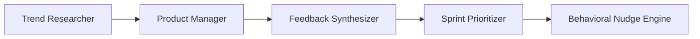
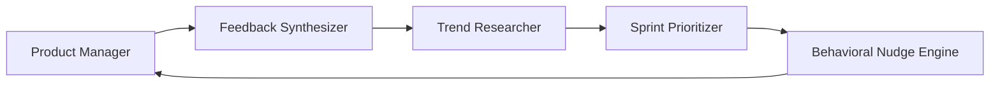
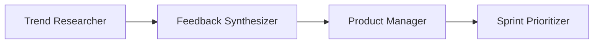

[根目录](../CLAUDE.md) > **product**

---

# Product Agents - AI Context Documentation

> **Category**: Product
> **Agent Count**: 5
> **Last Updated**: 2026-03-16

## 📋 Breadcrumb Navigation

[根目录](../CLAUDE.md) > **product**

---

## Module Overview

The Product category contains **5 specialized agents** covering the complete product management lifecycle, from strategic discovery and market research through sprint planning, user feedback synthesis, and behavioral optimization. These agents bridge business goals, user needs, and technical execution to ship the right products at the right time.

### Core Philosophy

Product agents are designed to be:
- **Outcome-Obsessed**: Focused on measurable impact, not just feature shipping
- **User-Grounded**: Decisions backed by user research, behavioral data, and evidence
- **Data-Informed**: Quantitative insights balanced with qualitative judgment
- **Strategically Ruthless**: Clear prioritization, explicit trade-offs, and focused execution

---

## Agent Inventory

### Core Product Management (2 agents)

| Agent | Specialty | Key Capabilities |
|-------|-----------|------------------|
| **Product Manager** | Full product lifecycle owner | Discovery, strategy, roadmap, GTM, stakeholder alignment, outcome measurement |
| **Sprint Prioritizer** | Agile planning & execution | Sprint planning, prioritization frameworks, capacity planning, velocity optimization |

### Research & Insights (2 agents)

| Agent | Specialty | Key Capabilities |
|-------|-----------|------------------|
| **Feedback Synthesizer** | User feedback analysis | Multi-channel collection, sentiment analysis, thematic synthesis, actionable insights |
| **Trend Researcher** | Market intelligence | Competitive analysis, trend forecasting, opportunity assessment, technology scouting |

### Behavioral Design (1 agent)

| Agent | Specialty | Key Capabilities |
|-------|-----------|------------------|
| **Behavioral Nudge Engine** | User motivation & engagement | Cadence personalization, cognitive load reduction, momentum building, gamification |

---

## Key Interfaces & Workflows

### Common Product Patterns

#### Product Discovery & Development Workflow



**Agent Sequence**:
1. **Trend Researcher**: Identify market opportunities, competitive landscape, and emerging trends
2. **Product Manager**: Define product strategy, requirements, and success metrics
3. **Feedback Synthesizer**: Gather and analyze user feedback to validate hypotheses
4. **Sprint Prioritizer**: Plan and prioritize development work based on impact and effort
5. **Behavioral Nudge Engine**: Optimize user engagement and adoption through behavioral design

#### Continuous Product Improvement Workflow



**Agent Sequence**:
1. **Product Manager**: Launch feature and define success metrics
2. **Feedback Synthesizer**: Collect and analyze user feedback and behavioral data
3. **Trend Researcher**: Monitor market changes and competitive movements
4. **Sprint Prioritizer**: Prioritize improvements based on feedback and market insights
5. **Behavioral Nudge Engine**: Optimize user engagement and feature adoption
6. **Product Manager**: Iterate on product based on insights (cycle repeats)

#### Strategic Planning Workflow



**Agent Sequence**:
1. **Trend Researcher**: Provide market intelligence and strategic opportunities
2. **Feedback Synthesizer**: Synthesize user needs and pain points
3. **Product Manager**: Develop product strategy and roadmap
4. **Sprint Prioritizer**: Translate strategy into actionable sprint plans

---

## Technical Deliverables

### Product Manager Output Example

```markdown
# PRD: AI-Powered Smart Notifications
**Status**: Draft
**Author**: Product Manager  **Last Updated**: 2026-03-16
**Version**: 1.0

## Problem Statement
Users are overwhelmed by generic notification bursts, leading to notification fatigue and 47% opt-out rate within 30 days. Current "one-size-fits-all" approach doesn't account for individual work patterns, focus hours, or communication preferences.

**Evidence**:
- User research: 12/15 interviews cite "too many notifications" as top pain point
- Behavioral data: 67% of users disable notifications within first week
- Support signal: 23% of tickets related to notification management
- Competitive signal: Slack and Notion have implemented smart scheduling

## Goals & Success Metrics
| Goal | Metric | Current Baseline | Target | Measurement Window |
|------|--------|-----------------|--------|--------------------|
| Reduce opt-out rate | % users with notifications enabled | 53% | 75% | 90 days post-launch |
| Improve engagement | Avg daily interactions | 2.3 | 3.5 | 60 days post-launch |
| Increase satisfaction | NPS score | 32 | 45 | 90 days post-launch |

## User Stories
**Story 1**: As a user, I want to schedule my quiet hours so that I'm not interrupted during focus time.
**Acceptance Criteria**:
- Given I have set quiet hours from 9 AM - 11 AM
- When I receive a notification during that time
- Then it should be bundled and delivered at 11 AM

**Story 2**: As a user, I want to choose my preferred notification channels for different types of messages.
**Acceptance Criteria**:
- Given I am in notification preferences
- When I select "SMS for urgent", "Email for digest"
- Then the system should route messages accordingly
```

### Feedback Synthesizer Output Example

```markdown
# User Feedback Synthesis Report - Q1 2026
**Analysis Period**: Jan 1 - Mar 31, 2026
**Total Feedback Items**: 2,847
**Key Themes Identified**: 12

## Executive Summary
🔴 **Critical Priority** (High Volume + High Impact):
1. Mobile app performance issues - 347 mentions (12%)
   - "App crashes when switching between tabs" - 89 occurrences
   - Impact: 23% of mobile users report daily crashes
   - Recommendation: Critical fix for Q2 sprint

2. Notification customization - 289 mentions (10%)
   - "Too many notifications" - 156 occurrences
   - "Want to control what I'm notified about" - 98 occurrences
   - Recommendation: Aligns with proposed Smart Notifications feature

## Top Feature Requests
| Feature | Requests | Impact | Effort | Priority Score |
|---------|----------|---------|---------|----------------|
| Dark mode | 423 | High | Medium | 127 (RICE) |
| Calendar integration | 312 | High | High | 78 (RICE) |
| Advanced search | 267 | Medium | Medium | 67 (RICE) |

## Sentiment Analysis
- **Overall Sentiment**: 6.2/10 (↑ from 5.8 in Q4)
- **Promoters (9-10)**: 34% (↑ 3pp)
- **Passives (7-8)**: 42% (↑ 2pp)
- **Detractors (0-6)**: 24% (↓ 5pp)
```

### Sprint Prioritizer Output Example

```markdown
# Sprint 24 Plan - April 2026
**Sprint Goal**: Deliver Smart Notifications MVP to reduce opt-out rate by 15pp
**Team Capacity**: 85 points (6 developers × 2 weeks)
**Velocity (3-sprint avg)**: 78 points

## Committed Stories
| Story | Points | Owner | RICE Score | Business Value |
|-------|--------|-------|------------|----------------|
| Quiet hours scheduling | 8 | @sarah | 127 | Reduces churn risk |
| Channel preferences | 5 | @mike | 98 | Improves engagement |
| Notification bundling | 13 | @alex | 89 | Enhances UX |
| Analytics dashboard | 8 | @jen | 67 | Enables measurement |
| **Total** | **34** | | | |

## Scope Changes
| Request | Source | Decision | Rationale |
|---------|--------|----------|-----------|
| Add Slack integration | Sales | Defer to v2 | Scope increase, validate base first |
| Mobile app support | Product | Accept (split) | Critical for 47% of users |

## Risks
| Risk | Impact | Mitigation | Owner |
|------|--------|------------|-------|
| API rate limits | High | Implement caching | @alex |
| User adoption uncertainty | Medium | A/B test with 20% rollout | @sarah |
```

### Behavioral Nudge Engine Output Example

```typescript
// Behavioral Engine: Personalized Nudge System
interface UserProfile {
  preferredChannel: 'SMS' | 'EMAIL' | 'IN_APP';
  interactionStyle: 'ADHD' | 'FOCUSED' | 'OVERWHELMED';
  optimalTimes: number[]; // Hours when user is most active
  motivationalTriggers: ('gamification' | 'progress' | 'social_proof')[];
}

export function generatePersonalizedNudge(
  user: UserProfile,
  pendingTasks: Task[],
  engagementHistory: EngagementData
): Nudge {
  // Cognitive load reduction for overwhelmed users
  if (user.interactionStyle === 'OVERWHELMED' && pendingTasks.length > 10) {
    return {
      channel: user.preferredChannel,
      message: "You have 1 quick task waiting. Takes 2 mins. Ready?",
      actionButton: "Start 2-Min Sprint",
      tone: 'encouraging',
      timing: getNextOptimalTime(user.optimalTimes)
    };
  }

  // Gamification for competitive users
  if (user.motivationalTriggers.includes('gamification')) {
    const streak = engagementHistory.currentStreak;
    return {
      channel: 'IN_APP',
      message: `🔥 ${streak} day streak! Complete this task to keep it going.`,
      actionButton: "Maintain Streak",
      tone: 'energetic',
      celebration: await generateCelebration(streak + 1)
    };
  }

  // Default: Progress-focused nudge
  const completedToday = engagementHistory.tasksCompleted;
  return {
    channel: user.preferredChannel,
    message: `Great progress! ${completedToday} tasks done. One more quick win?`,
    actionButton: "Quick Win",
    tone: 'supportive'
  };
}
```

### Trend Researcher Output Example

```markdown
# Market Trend Report - AI-Powered Productivity Tools 2026
**Report Date**: March 2026
**Forecast Horizon**: 6-12 months
**Confidence Level**: 82%

## Executive Summary
🔥 **Emerging Trend**: AI-native productivity tools are shifting from "smart features" to "predictive workspaces"
- **Adoption Timeline**: Mainstream adoption expected by Q4 2026
- **Market Impact**: $2.3B TAM growing at 38% CAGR
- **Competitive Threat**: High - 12 startups funded in Q1 2026

## Key Trends

### 1. Predictive Task Prioritization
**Signal Strength**: Strong
**Evidence**:
- +340% search volume for "AI task prioritization" (Google Trends)
- 3 recent product launches: Notion AI, Todoist Intelligence, Motion 2.0
- $45M VC funding in predictive productivity space (Jan-Mar 2026)

**Strategic Implications**:
- Opportunity: Differentiate through superior prediction accuracy
- Risk: First-mover advantage for competitors
- Recommendation: Prioritize for Q3 roadmap

### 2. Ambient Computing Integration
**Signal Strength**: Moderate
**Evidence**:
- Apple and Google emphasizing "ambient intelligence" at recent conferences
- 67% of users want "less app switching" (survey, n=2,400)
- Patent filings up 156% for context-aware productivity (2025)

**Strategic Implications**:
- Opportunity: Reduce friction through ambient notifications
- Risk: Platform dependency on Apple/Google ecosystems
- Recommendation: R&D spike in Q2, decision by Q3

## Competitive Landscape
| Competitor | Smart Notifications | AI Prioritization | Market Share |
|------------|-------------------|-------------------|--------------|
| Notion AI | ✅ Launched Jan 2026 | ✅ Planned Q2 | 28% |
| Asana Intelligence | ✅ Beta | ❌ | 19% |
| Monday.com | ✅ | 🔄 Testing | 15% |
| Our Product | ❌ | ❌ | 8% |

**Recommendation**: Fast-track Smart Notifications to avoid falling further behind
```

---

## Dependencies & Integrations

### External Data Sources

Product agents integrate with various tools and platforms:

- **User Research**: UserInterviews, Dovetail, UserTesting, Maze
- **Analytics**: Mixpanel, Amplitude, Google Analytics, Heap
- **Feedback Channels**: Intercom, Zendesk, Salesforce, G2, Capterra
- **Market Intelligence**: Google Trends, SEMrush, Ahrefs, Statista, CB Insights
- **Project Management**: Jira, Linear, Asana, Monday.com, Notion
- **Communication**: Slack, Discord, Email, SMS platforms

### Integration Patterns

```bash
# Convert product agents for different tools
./scripts/convert.sh --tool cursor     # .cursor/rules/*.mdc
./scripts/convert.sh --tool opencode   # .opencode/agents/*.md
./scripts/convert.sh --tool qwen       # .qwen/agents/*.md
```

---

## Testing & Quality Assurance

### Quality Standards for Product Agents

- ✅ **Evidence-Based**: All recommendations backed by data or user research
- ✅ **Measurable Outcomes**: Clear success metrics and tracking defined
- ✅ **User-Centered**: Decisions grounded in user needs and behaviors
- ✅ **Strategic Alignment**: Connected to business goals and OKRs
- ✅ **Stakeholder Communication**: Clear, actionable, and timely updates
- ✅ **Iterative Learning**: Continuous feedback loops and improvement

### Success Metrics

Product agents should deliver:
- **Strategic Clarity**: Clear product vision and roadmap alignment
- **User Insights**: Actionable feedback synthesis and opportunity identification
- **Prioritization Rigor**: Data-driven backlog management with explicit trade-offs
- **Sprint Predictability**: Reliable delivery forecasts and capacity planning
- **Market Intelligence**: Early trend detection and competitive analysis
- **Engagement Optimization**: Behavioral interventions that improve user outcomes

---

## Common Workflows

### 1. Product Discovery Workflow

```
Trend Researcher → Product Manager → Feedback Synthesizer → Product Manager
```

**Steps**:
1. Identify market opportunities and trends (Trend Researcher)
2. Define product strategy and opportunity assessment (Product Manager)
3. Validate with user feedback and research (Feedback Synthesizer)
4. Make build/explore/defer decision (Product Manager)

### 2. Sprint Planning Workflow

```
Feedback Synthesizer → Product Manager → Sprint Prioritizer → Behavioral Nudge Engine
```

**Steps**:
1. Synthesize user feedback into feature requests (Feedback Synthesizer)
2. Prioritize based on business value and user impact (Product Manager)
3. Create detailed sprint plan with capacity allocation (Sprint Prioritizer)
4. Design engagement strategy for new features (Behavioral Nudge Engine)

### 3. Feature Launch Workflow

```
Product Manager → Sprint Prioritizer → Behavioral Nudge Engine → Feedback Synthesizer
```

**Steps**:
1. Define launch plan and success criteria (Product Manager)
2. Coordinate delivery and rollout (Sprint Prioritizer)
3. Optimize user onboarding and adoption (Behavioral Nudge Engine)
4. Monitor feedback and iterate (Feedback Synthesizer)

### 4. Strategic Planning Workflow

```
Trend Researcher → Feedback Synthesizer → Product Manager → Sprint Prioritizer
```

**Steps**:
1. Analyze market trends and competitive landscape (Trend Researcher)
2. Synthesize user needs and pain points (Feedback Synthesizer)
3. Develop product strategy and roadmap (Product Manager)
4. Translate into actionable plans (Sprint Prioritizer)

---

## FAQ

**Q: How do Product Manager and Sprint Prioritizer differ?**
A: Product Manager owns the full product lifecycle—strategy, discovery, roadmap, and outcomes. Sprint Prioritizer specializes in agile execution, sprint planning, and capacity optimization. They work together: Product Manager defines what to build and why; Sprint Prioritizer plans how to build it and when.

**Q: When should I use Feedback Synthesizer vs. Trend Researcher?**
A: Feedback Synthesizer analyzes your existing users' feedback to improve your current product. Trend Researcher looks outward at the market, competitors, and emerging opportunities to inform future strategy. Use both for a complete picture: internal user needs + external market context.

**Q: What's the role of Behavioral Nudge Engine?**
A: Behavioral Nudge Engine specializes in user psychology and engagement optimization. It designs interventions that improve user motivation, reduce cognitive load, and increase feature adoption. Use it when shipping new features (to optimize onboarding) or when engagement metrics need improvement.

**Q: Can these agents work together?**
A: Absolutely! Product agents are designed for multi-agent orchestration. See the Common Workflows section for examples of how they collaborate on discovery, planning, launches, and strategy.

**Q: How do I integrate product agents with development workflows?**
A: Product agents produce deliverables (PRDs, sprint plans, feedback reports) that feed directly into engineering workflows. The Product Manager creates PRDs that become backlog items for engineering agents. Sprint Prioritizer outputs guide sprint planning and capacity allocation.

---

## Related Files

- **[CLAUDE.md](../CLAUDE.md)** - Root documentation
- **[engineering/CLAUDE.md](../engineering/CLAUDE.md)** - Engineering agents documentation
- **[CONTRIBUTING.md](../CONTRIBUTING.md)** - Contribution guidelines
- **[scripts/convert.sh](../scripts/convert.sh)** - Conversion pipeline
- **[scripts/install.sh](../scripts/install.sh)** - Installation script

---

## Changelog

### 2026-03-16 - Category Documentation Created
- 📊 **Agent Inventory**: Cataloged all 5 product agents
- ✨ **Workflow Diagrams**: Added product management workflows
- 📋 **Technical Deliverables**: Included PRDs, feedback reports, sprint plans
- 🔗 **Integration Guide**: Documented tool compatibility and workflows
- ✅ **Quality Standards**: Defined success metrics and best practices
- 🎯 **Domain Focus**: Emphasized outcome-obsessed, user-grounded philosophy

---

<div align="center">

**Product Agents** - Your Strategic Product Team

5 Specialists • Full Lifecycle • User-Centered & Data-Driven

</div>
