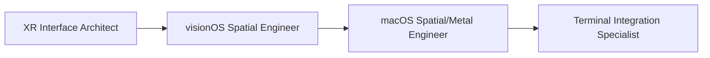
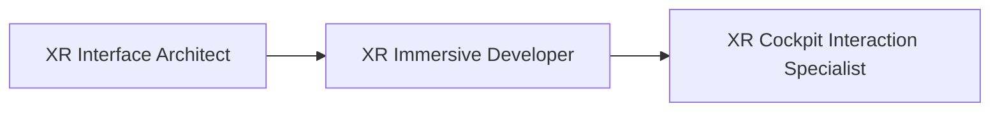
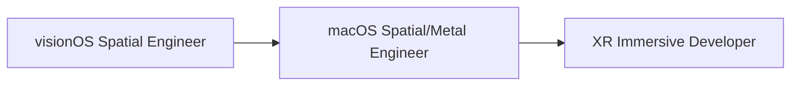

[根目录](../CLAUDE.md) > **spatial-computing**

---

# Spatial Computing Agents - AI Context Documentation

> **Category**: Spatial Computing
> **Agent Count**: 6
> **Last Updated**: 2026-03-16

## 📋 Breadcrumb Navigation

[根目录](../CLAUDE.md) > **spatial-computing**

---

## Module Overview

The Spatial Computing category contains **6 specialized agents** covering the full spectrum of XR, AR, VR, and spatial interface development for Apple platforms and WebXR technologies. From native Vision Pro development to cross-platform immersive experiences.

### Core Philosophy

Spatial computing agents are designed to be:
- **Platform-Specific**: Deep expertise in visionOS, WebXR, and Apple ecosystem integration
- **Performance-Conscious**: 90fps rendering targets, optimized Metal pipelines, GPU-efficient shaders
- **Human-Centered**: Comfort-focused design that minimizes motion sickness and maximizes presence
- **Immersive by Design**: Natural interactions using gaze, gestures, hand tracking, and spatial audio

---

## Agent Inventory

### Apple Platform Development (2 agents)

| Agent | Specialty | Key Technologies |
|-------|-----------|------------------|
| **visionOS Spatial Engineer** | Native visionOS development, SwiftUI volumetric interfaces, Liquid Glass design | SwiftUI, RealityKit, ARKit, visionOS 26 APIs |
| **macOS Spatial/Metal Engineer** | High-performance Metal rendering, Compositor Services, Vision Pro streaming | Metal, MetalKit, Compositor Services, RemoteImmersiveSpace |

### Cross-Platform XR (2 agents)

| Agent | Specialty | Key Technologies |
|-------|-----------|------------------|
| **XR Immersive Developer** | WebXR applications, browser-based AR/VR/XR, cross-platform compatibility | WebXR Device API, Three.js, A-Frame, Babylon.js |
| **XR Interface Architect** | Spatial UI/UX design, interaction patterns, immersive usability | Gaze+pinch, hand gestures, controller input, accessibility |

### Specialized Spatial Interfaces (2 agents)

| Agent | Specialty | Key Technologies |
|-------|-----------|------------------|
| **XR Cockpit Interaction Specialist** | Immersive cockpit environments, seated experiences, vehicle interfaces | Spatial controls, gesture systems, haptic feedback |
| **Terminal Integration Specialist** | Terminal emulation, SwiftTerm integration, text rendering optimization | SwiftTerm, VT100/xterm, Core Graphics, SSH integration |

---

## Key Interfaces & Workflows

### Common Spatial Computing Patterns

#### Vision Pro Application Development Workflow



**Agent Sequence**:
1. **XR Interface Architect**: Design spatial UI patterns and interaction flows
2. **visionOS Spatial Engineer**: Implement native SwiftUI volumetric interfaces with Liquid Glass
3. **macOS Spatial/Metal Engineer**: Optimize Metal rendering pipeline and performance
4. **Terminal Integration Specialist**: Add terminal emulation if needed for developer tools

#### WebXR Cross-Platform Development Workflow



**Agent Sequence**:
1. **XR Interface Architect**: Define spatial interaction patterns and UX guidelines
2. **XR Immersive Developer**: Implement WebXR application with cross-platform compatibility
3. **XR Cockpit Interaction Specialist**: Design specialized cockpit interfaces if needed

#### Spatial Performance Optimization Workflow



**Agent Sequence**:
1. **visionOS Spatial Engineer**: Identify performance bottlenecks in volumetric interfaces
2. **macOS Spatial/Metal Engineer**: Optimize Metal shaders and GPU rendering pipeline
3. **XR Immersive Developer**: Apply optimizations to WebXR implementations

---

## Technical Deliverables

### visionOS Spatial Interface Example

```swift
import SwiftUI
import RealityKit

struct VolumetricControlPanel: View {
    @State private var isHovered = false
    @State private var selection: String? = nil

    var body: some View {
        VStack(spacing: 20) {
            Text("Spatial Control Panel")
                .font(.title)
                .glassBackgroundEffect()

            HStack(spacing: 15) {
                ForEach(["Option A", "Option B", "Option C"], id: \.self) { option in
                    Button(action: { selection = option }) {
                        Text(option)
                            .padding()
                            .background(
                                RoundedRectangle(cornerRadius: 12)
                                    .fill(selection == option ? Color.blue.opacity(0.6) : Color.clear)
                            )
                            .glassBackgroundEffect()
                    }
                    .buttonStyle(.plain)
                }
            }
        }
        .padding(30)
        .glassBackgroundEffect(displayMode: .always)
        .rotation3DEffect(
            .degrees(isHovered ? 5 : 0),
            axis: (x: 0, y: 1, z: 0)
        )
        .onHover { hovering in
            withAnimation(.easeInOut(duration: 0.2)) {
                isHovered = hovering
            }
        }
    }
}
```

### Metal Rendering Pipeline Example

```swift
// High-performance Metal renderer for spatial computing
class SpatialMetalRenderer {
    private let device: MTLDevice
    private let commandQueue: MTLCommandQueue
    private var pipelineState: MTLRenderPipelineState

    // Instanced rendering for 3D content
    struct SpatialInstance {
        var position: SIMD3<Float>
        var rotation: SIMD4<Float>
        var scale: Float
        var materialId: UInt32
    }

    func renderSpatialContent(instances: [SpatialInstance], camera: Camera) {
        guard let commandBuffer = commandQueue.makeCommandBuffer(),
              let encoder = commandBuffer.makeRenderCommandEncoder(descriptor: descriptor) else {
            return
        }

        // Set up stereoscopic rendering
        var uniforms = StereoUniforms(
            leftViewMatrix: camera.leftViewMatrix,
            rightViewMatrix: camera.rightViewMatrix,
            projectionMatrix: camera.projectionMatrix
        )

        encoder.setRenderPipelineState(pipelineState)
        encoder.setVertexBuffer(uniformBuffer, offset: 0, index: 0)

        // Instanced draw call for performance
        encoder.drawPrimitives(
            type: .triangle,
            vertexStart: 0,
            vertexCount: vertexCount,
            instanceCount: instances.count
        )

        encoder.endEncoding()
        commandBuffer.present(drawable)
        commandBuffer.commit()
    }
}
```

### WebXR Immersive Experience Example

```javascript
// WebXR immersive scene setup
async function initImmersiveExperience() {
    const xrSession = await navigator.xr.requestSession('immersive-vr', {
        optionalFeatures: ['local-floor', 'hand-tracking', 'hit-test']
    });

    const renderer = new THREE.WebGLRenderer({ xrEnabled: true });
    renderer.setXRSession(xrSession);

    // Spatial input handling
    xrSession.addEventListener('select', (event) => {
        const inputSource = event.inputSource;
        const pose = event.frame.getPose(inputSource.targetRaySpace, xrSession.referenceSpace);

        if (pose) {
            handleSpatialSelection(pose.transform.position);
        }
    });

    // Gaze and gesture interaction
    xrSession.addEventListener('inputsourceschange', (event) => {
        event.added.forEach((inputSource) => {
            if (inputSource.hand) {
                setupHandTracking(inputSource.hand);
            }
        });
    });
}

function setupHandTracking(hand) {
    // Implement pinch gesture recognition
    hand.addEventListener('pinchstart', (event) => {
        const pinchPosition = event.position;
        activateSpatialControl(pinchPosition);
    });
}
```

---

## Dependencies & Integrations

### Platform-Specific Dependencies

**visionOS Development**:
- **Xcode 16+**: Latest Xcode with visionOS SDK
- **visionOS 26 SDK**: Native spatial computing APIs
- **RealityKit 4**: 3D content and spatial anchors
- **SwiftUI for visionOS**: Volumetric UI components

**macOS Metal Development**:
- **Metal 3 Framework**: GPU rendering pipeline
- **MetalKit**: Rendering utilities and view management
- **CompositorServices**: Vision Pro streaming integration
- **Metal Performance Headers**: GPU optimization utilities

**WebXR Cross-Platform**:
- **WebXR Device API**: Browser-based XR support
- **Three.js / A-Frame**: 3D graphics frameworks
- **WebXR Input Profiles**: Controller and hand tracking

### Development Tools Integration

```bash
# Convert spatial-computing agents for different tools
./scripts/convert.sh --tool cursor     # .cursor/rules/*.mdc
./scripts/convert.sh --tool opencode   # .opencode/agents/*.md
./scripts/convert.sh --tool qwen       # .qwen/agents/*.md
```

---

## Testing & Quality Assurance

### Quality Standards for Spatial Computing Agents

- ✅ **90fps Performance**: All rendering must maintain 90fps minimum
- ✅ **Comfort Guidelines**: Follow Human Interface Guidelines for spatial computing
- ✅ **Motion Safety**: Implement vergence-accommodation conflict prevention
- ✅ **Accessibility**: VoiceOver, Switch Control, and spatial navigation support
- ✅ **Cross-Platform**: Test on Meta Quest, Vision Pro, HoloLens, mobile AR
- ✅ **Input Latency**: Keep end-to-end latency under 50ms for spatial interactions

### Success Metrics

Spatial computing agents should deliver:
- **Smooth Performance**: Consistent 90fps rendering with 25k+ objects
- **Natural Interactions**: Intuitive gaze, gesture, and hand tracking
- **Comfortable Experience**: No motion sickness after extended use
- **Visual Fidelity**: High-quality materials and lighting in spatial contexts
- **Responsive UI**: Immediate feedback for all spatial interactions

---

## Common Workflows

### 1. Vision Pro Application Development

```
XR Interface Architect → visionOS Spatial Engineer → macOS Spatial/Metal Engineer → Terminal Integration Specialist
```

**Steps**:
1. Design spatial UI patterns and interaction flows (XR Interface Architect)
2. Implement native SwiftUI volumetric interfaces (visionOS Spatial Engineer)
3. Optimize Metal rendering for 90fps performance (macOS Spatial/Metal Engineer)
4. Add terminal emulation if needed (Terminal Integration Specialist)

### 2. WebXR Cross-Platform Experience

```
XR Interface Architect → XR Immersive Developer → XR Cockpit Interaction Specialist
```

**Steps**:
1. Define spatial interaction patterns (XR Interface Architect)
2. Implement WebXR application with cross-platform support (XR Immersive Developer)
3. Design specialized cockpit interfaces (XR Cockpit Interaction Specialist)

### 3. Spatial Performance Optimization

```
visionOS Spatial Engineer → macOS Spatial/Metal Engineer → XR Immersive Developer
```

**Steps**:
1. Identify performance bottlenecks (visionOS Spatial Engineer)
2. Optimize Metal shaders and GPU pipeline (macOS Spatial/Metal Engineer)
3. Apply optimizations to WebXR (XR Immersive Developer)

---

## FAQ

**Q: What's the difference between visionOS Spatial Engineer and macOS Spatial/Metal Engineer?**
A: visionOS Spatial Engineer specializes in native visionOS development using SwiftUI and RealityKit for volumetric interfaces. macOS Spatial/Metal Engineer focuses on high-performance Metal rendering and GPU optimization for both macOS and Vision Pro streaming.

**Q: When should I use XR Immersive Developer vs. visionOS Spatial Engineer?**
A: XR Immersive Developer for cross-platform WebXR applications that run in browsers across different headsets. visionOS Spatial Engineer for native visionOS applications that require deep platform integration and Liquid Glass design.

**Q: What does XR Cockpit Interaction Specialist do differently from XR Interface Architect?**
A: XR Cockpit Interaction Specialist focuses exclusively on seated, fixed-perspective cockpit environments with vehicle-style controls. XR Interface Architect designs general spatial UI patterns and interactions for any immersive application.

**Q: Can these agents work together on a single project?**
A: Yes! Spatial computing agents are designed to collaborate. See the Common Workflows section for examples of multi-agent spatial development workflows.

---

## Related Files

- **[CLAUDE.md](../CLAUDE.md)** - Root documentation
- **[CONTRIBUTING.md](../CONTRIBUTING.md)** - Contribution guidelines
- **[scripts/convert.sh](../scripts/convert.sh)** - Conversion pipeline
- **[scripts/install.sh](../scripts/install.sh)** - Installation script
- **[engineering/CLAUDE.md](../engineering/CLAUDE.md)** - Related engineering agents

---

## Changelog

### 2026-03-16 - Category Documentation Created
- 📊 **Agent Inventory**: Cataloged all 6 spatial-computing agents
- ✨ **Workflow Diagrams**: Added Vision Pro and WebXR development workflows
- 📋 **Technical Deliverables**: Included Swift, Metal, and WebXR code examples
- 🔗 **Integration Guide**: Documented platform-specific dependencies and tools
- ✅ **Quality Standards**: Defined 90fps performance and comfort guidelines

---

<div align="center">

**Spatial Computing Agents** - Your XR Development Team

6 Specialists • visionOS + WebXR • Immersive Experiences

</div>
