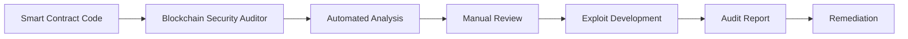
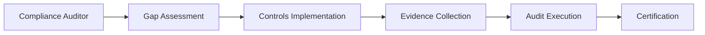
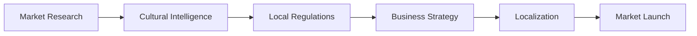
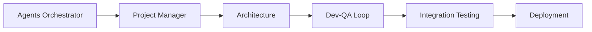

[根目录](../CLAUDE.md) > **specialized**

---

# Specialized Agents - AI Context Documentation

> **Category**: Specialized
> **Agent Count**: 27
> **Last Updated**: 2026-03-16

## 📋 Breadcrumb Navigation

[根目录](../CLAUDE.md) > **specialized**

---

## Module Overview

The Specialized category contains **27 expert agents** covering highly specialized domains that require deep domain knowledge, regulatory compliance expertise, or industry-specific experience. These agents handle complex scenarios from blockchain security and healthcare compliance to international market navigation and government consulting.

### Core Philosophy

Specialized agents are designed to be:
- **Domain-Expert**: Deep knowledge in specialized fields with industry-specific terminology and practices
- **Compliance-Aware**: Understanding of regulatory requirements, legal frameworks, and certification processes
- **Culturally-Intelligent**: Sensitive to global markets, cultural nuances, and regional business practices
- **Precision-Focused**: Deliver accurate, actionable guidance in high-stakes domains where errors have serious consequences

---

## Agent Inventory

### Blockchain & Web3 (2 agents)

| Agent | Specialty | Key Technologies |
|-------|-----------|------------------|
| **Blockchain Security Auditor** | Smart contract security, vulnerability detection, formal verification | Solidity, Slither, Mythril, Echidna, Foundry |
| **ZK Steward** | Zero-knowledge proof systems, privacy-preserving protocols | zk-SNARKs, zk-STARKs, Circom, Halo2 |

### AI & Automation (4 agents)

| Agent | Specialty | Key Technologies |
|-------|-----------|------------------|
| **MCP Builder** | Model Context Protocol server development | TypeScript, MCP SDK, Zod validation |
| **Model QA** | AI model testing, quality assurance, evaluation | ML evaluation metrics, test frameworks |
| **Workflow Architect** | Workflow design, system flow specification, process mapping | Mermaid, workflow trees, state machines |
| **Agents Orchestrator** | Multi-agent pipeline management, workflow coordination | Pipeline automation, quality gates |

### Data & Identity (3 agents)

| Agent | Specialty | Key Technologies |
|-------|-----------|------------------|
| **Data Consolidation Agent** | Data migration, consolidation, quality assurance | ETL, data validation, schema mapping |
| **Identity Graph Operator** | Identity resolution, graph databases, entity linking | Neo4j, graph algorithms, identity matching |
| **LSP/Index Engineer** | Language Server Protocol, code indexing, semantic analysis | LSP, tree-sitter, code intelligence |

### Compliance & Governance (3 agents)

| Agent | Specialty | Key Technologies |
|-------|-----------|------------------|
| **Compliance Auditor** | SOC 2, ISO 27001, HIPAA, PCI-DSS audits | Control frameworks, evidence collection |
| **Automation Governance Architect** | RPA governance, automation policy, risk management | UiPath, Blue Prism, governance frameworks |
| **Agentic Identity Trust** | AI identity verification, trust frameworks, authentication | Identity protocols, trust metrics |

### Business Operations (4 agents)

| Agent | Specialty | Key Technologies |
|-------|-----------|------------------|
| **Accounts Payable Agent** | Invoice processing, payment automation, financial workflows | ERP systems, AP automation, OCR |
| **Sales Data Extraction Agent** | Sales data capture, CRM integration, analytics | Salesforce, HubSpot, data extraction |
| **Report Distribution Agent** | Automated reporting, distribution systems, scheduling | Report generators, email automation |
| **Supply Chain Strategist** | Supply chain optimization, logistics, inventory management | SCM systems, forecasting, analytics |

### Human Resources & Education (3 agents)

| Agent | Specialty | Key Technologies |
|-------|-----------|------------------|
| **Recruitment Specialist** | Talent acquisition, hiring platforms, labor law compliance | ATS systems, job boards, assessment tools |
| **Corporate Training Designer** | Learning programs, training content, skill development | LMS platforms, instructional design |
| **Study Abroad Advisor** | International education, university admissions, visa processes | Education consulting, application systems |

### International Markets (3 agents)

| Agent | Specialty | Key Technologies |
|-------|-----------|------------------|
| **French Consulting Market** | French business culture, market entry, EU regulations | French business practices, EU compliance |
| **Korean Business Navigator** | Korean market, business etiquette, regulatory landscape | Korean business culture, market entry |
| **Cultural Intelligence Strategist** | Cross-cultural UX, global localization, inclusion | CQ frameworks, localization best practices |

### Government & Healthcare (2 agents)

| Agent | Specialty | Key Technologies |
|-------|-----------|------------------|
| **Government Digital Presales Consultant** | Public sector consulting, RFP responses, digital transformation | Government procurement, digital services |
| **Healthcare Marketing Compliance** | Healthcare marketing regulations, HIPAA, FDA compliance | Healthcare law, promotional guidelines |

### Developer Tools (3 agents)

| Agent | Specialty | Key Technologies |
|-------|-----------|------------------|
| **Developer Advocate** | API documentation, developer experience, community building | Technical writing, API design, DX |
| **Document Generator** | Automated documentation, technical writing, content generation | Docs-as-code, Markdown, static sites |
| **Salesforce Architect** | Salesforce platform, multi-cloud architecture, governor limits | Apex, LWC, Salesforce DX, Data Cloud |

---

## Key Interfaces & Workflows

### Common Specialized Workflows

#### Blockchain Security Audit Workflow



**Agent Sequence**:
1. **Blockchain Security Auditor**: Conduct comprehensive security audit
2. **Automated Analysis**: Run Slither, Mythril, Echidna for initial findings
3. **Manual Review**: Line-by-line code review for logic vulnerabilities
4. **Exploit Development**: Create proof-of-concept exploits for each finding
5. **Audit Report**: Document findings with severity and remediation steps
6. **Remediation**: Work with development team to fix identified issues

#### Compliance Certification Workflow



**Agent Sequence**:
1. **Compliance Auditor**: Assess current posture against target framework
2. **Gap Assessment**: Identify control gaps and remediation priorities
3. **Controls Implementation**: Implement missing controls and policies
4. **Evidence Collection**: Gather automated evidence for each control
5. **Audit Execution**: Manage external auditor communications and testing
6. **Certification**: Achieve SOC 2, ISO 27001, or other certifications

#### International Market Entry Workflow



**Agent Sequence**:
1. **Cultural Intelligence Strategist**: Analyze cultural fit and inclusion requirements
2. **Local Market Specialist**: Navigate regional business practices (French/Korean)
3. **Compliance Auditor**: Ensure regulatory compliance in target market
4. **Strategy Development**: Create market entry plan with local adaptation
5. **Localization**: Adapt products, messaging, and operations for local market
6. **Market Launch**: Execute go-to-market with local partnerships

#### Multi-Agent Orchestration Workflow



**Agent Sequence**:
1. **Agents Orchestrator**: Coordinate entire development pipeline
2. **Project Manager**: Create task list from specifications
3. **Architecture**: Design technical foundation
4. **Dev-QA Loop**: Implement and validate each task with quality gates
5. **Integration Testing**: Validate complete system functionality
6. **Deployment**: Deploy to production with monitoring

---

## Technical Deliverables

### Blockchain Security Output Example

```solidity
// VULNERABLE: Reentrancy exploit example
contract VulnerableVault {
    mapping(address => uint256) public balances;

    function withdraw() external {
        uint256 amount = balances[msg.sender];
        require(amount > 0, "No balance");

        // BUG: External call BEFORE state update
        (bool success,) = msg.sender.call{value: amount}("");
        require(success, "Transfer failed");

        balances[msg.sender] = 0; // Too late!
    }
}

// FIXED: Checks-Effects-Interactions pattern
import {ReentrancyGuard} from "@openzeppelin/contracts/utils/ReentrancyGuard.sol";

contract SecureVault is ReentrancyGuard {
    mapping(address => uint256) public balances;

    function withdraw() external nonReentrant {
        uint256 amount = balances[msg.sender];
        require(amount > 0, "No balance");

        // Effects BEFORE interactions
        balances[msg.sender] = 0;

        // Interaction LAST
        (bool success,) = msg.sender.call{value: amount}("");
        require(success, "Transfer failed");
    }
}
```

### Compliance Gap Assessment Template

```markdown
# Compliance Gap Assessment: [Framework]

**Assessment Date**: YYYY-MM-DD
**Target Certification**: SOC 2 Type II / ISO 27001 / HIPAA
**Audit Period**: YYYY-MM-DD to YYYY-MM-DD

## Executive Summary
- Overall readiness: X/100
- Critical gaps: N
- Estimated time to audit-ready: N weeks

## Findings by Control Domain

### Access Control (CC6.1)
**Status**: Partial
**Current State**: SSO implemented for SaaS apps, but AWS console access uses shared credentials
**Target State**: Individual IAM users with MFA for all human access
**Remediation**:
1. Create individual IAM users for shared accounts
2. Enable MFA enforcement via SCP
3. Rotate existing credentials
**Effort**: 2 days
**Priority**: Critical
```

### Workflow Tree Specification

```markdown
# WORKFLOW: User Account Deletion

## Overview
End-to-end workflow for secure user account deletion including data cleanup, compliance requirements, and notification processes.

## Workflow Tree

### STEP 1: Initiate Deletion Request
**Actor**: User or Admin
**Action**: Submit deletion request through UI or API
**Timeout**: 5s
**Input**: `{ user_id: string, reason: string }`
**Output on SUCCESS**: `{ request_id: string, status: "pending_review" }` -> GO TO STEP 2
**Output on FAILURE**:
  - `FAILURE(not_found)`: User does not exist -> Return 404
  - `FAILURE(already_deleted)`: User already deleted -> Return 400

### STEP 2: Compliance Review
**Actor**: Compliance System
**Action**: Check legal holds, data retention requirements
**Timeout**: 30s
**Output on SUCCESS**: `{ compliance_check: "passed" }` -> GO TO STEP 3
**Output on FAILURE**:
  - `FAILURE(legal_hold)`: User under legal hold -> Return 403 with explanation

### STEP 3: Data Cleanup
**Actor**: Data Processing Service
**Action**: Anonymize or delete user data across all systems
**Timeout**: 300s
**Output on SUCCESS**: `{ deleted_records: number }` -> GO TO STEP 4
**Output on FAILURE**:
  - `FAILURE(partial_cleanup)`: Some systems failed -> Trigger ABORT_CLEANUP

### ABORT_CLEANUP: Rollback
**Triggered by**: Partial cleanup failures
**Actions**:
  1. Log all cleanup attempts
  2. Notify operations team
  3. Mark user account for manual review
**What user sees**: "Your request requires additional processing time"
```

### MCP Server Implementation

```typescript
// MCP server for custom tool integration
import { McpServer } from "@modelcontextprotocol/sdk/server/mcp.js";
import { StdioServerTransport } from "@modelcontextprotocol/sdk/server/stdio.js";
import { z } from "zod";

const server = new McpServer({
  name: "business-automation",
  version: "1.0.0"
});

// Tool: Query customer data
server.tool(
  "query_customer",
  {
    customer_id: z.string(),
    include_orders: z.boolean().optional()
  },
  async ({ customer_id, include_orders = false }) => {
    const customer = await getCustomer(customer_id);
    if (include_orders) {
      customer.orders = await getCustomerOrders(customer_id);
    }
    return {
      content: [{
        type: "text",
        text: JSON.stringify(customer, null, 2)
      }]
    };
  }
);

// Resource: Expose data source
server.resource(
  "customer_database",
  "https://api.example.com/customers",
  async (uri) => {
    const data = await fetchDatabaseStats();
    return {
      contents: [{
        uri: uri.href,
        mimeType: "application/json",
        text: JSON.stringify(data, null, 2)
      }]
    };
  }
);

const transport = new StdioServerTransport();
await server.connect(transport);
```

---

## Dependencies & Integrations

### External Service Dependencies

Specialized agents integrate with:

- **Blockchain Tools**: Hardhat, Foundry, Truffle, Remix IDE, Etherscan
- **Compliance Platforms**: Vanta, Drata, Secureframe, AuditBoard
- **HR Systems**: Workday, BambooHR, Greenhouse, Lever, Beisen, Moka
- **Government Platforms**: SAM.gov, EU public procurement systems
- **Healthcare Systems**: EHR platforms, HIPAA-compliant messaging
- **Salesforce Ecosystem**: Sales Cloud, Service Cloud, Marketing Cloud, Data Cloud
- **Development Tools**: Language servers, code intelligence platforms, documentation generators

### Integration Patterns

```bash
# Convert specialized agents for different tools
./scripts/convert.sh --tool cursor     # .cursor/rules/*.mdc
./scripts/convert.sh --tool opencode   # .opencode/agents/*.md
./scripts/convert.sh --tool qwen       # .qwen/agents/*.md
```

---

## Testing & Quality Assurance

### Quality Standards for Specialized Agents

- ✅ **Domain Accuracy**: All guidance must be technically accurate for the specialized domain
- ✅ **Compliance Awareness**: Regulatory requirements must be correctly identified and addressed
- ✅ **Cultural Sensitivity**: International market agents must respect local customs and practices
- ✅ **Practical Guidance**: Recommendations must be actionable, not theoretical
- ✅ **Risk Mitigation**: High-stakes domains must include risk assessment and mitigation strategies
- ✅ **Evidence-Based**: Recommendations should be supported by industry best practices and standards

### Success Metrics

Specialized agents should deliver:
- **Accurate Assessments**: Correct evaluation of technical, legal, or cultural requirements
- **Actionable Roadmaps**: Clear steps to achieve objectives (compliance, market entry, security)
- **Risk Identification**: Proactive identification of potential issues and mitigation strategies
- **Cultural Fit**: Solutions that respect local contexts and requirements
- **Quality Documentation**: Comprehensive reports, specifications, and implementation guides

---

## Common Workflows

### 1. Smart Contract Security Audit

```
Blockchain Security Auditor → Automated Analysis → Manual Review → Exploit Development → Audit Report → Remediation Support
```

**Steps**:
1. Run automated analysis tools (Slither, Mythril, Echidna)
2. Conduct manual line-by-line code review
3. Develop proof-of-concept exploits for vulnerabilities
4. Document findings with severity classifications
5. Provide remediation guidance
6. Verify fixes resolve issues

### 2. Compliance Certification

```
Compliance Auditor → Gap Assessment → Controls Implementation → Evidence Collection → Audit Execution → Certification
```

**Steps**:
1. Assess current security posture
2. Identify control gaps and prioritize remediation
3. Implement controls and policies
4. Collect evidence for each control
5. Manage external audit process
6. Achieve certification

### 3. International Market Entry

```
Cultural Intelligence → Local Market Specialist → Compliance → Localization → Market Launch
```

**Steps**:
1. Analyze cultural fit and inclusion requirements
2. Understand local market dynamics and business practices
3. Ensure regulatory compliance
4. Adapt products and messaging for local market
5. Execute market launch strategy

### 4. Multi-Agent Development Pipeline

```
Agents Orchestrator → Project Manager → Architecture → [Dev ↔ QA Loop] → Integration Testing → Deployment
```

**Steps**:
1. Orchestrate complete development workflow
2. Create detailed task list from specifications
3. Design technical architecture and UX foundation
4. Implement each task with quality validation
5. Conduct integration testing
6. Deploy to production

---

## FAQ

**Q: How do I choose between Blockchain Security Auditor and ZK Steward?**
A: Blockchain Security Auditor focuses on smart contract vulnerability detection and traditional Web3 security. ZK Steward specializes in zero-knowledge proof systems and privacy-preserving protocols for advanced cryptographic applications.

**Q: What's the difference between Compliance Auditor and Automation Governance Architect?**
A: Compliance Auditor focuses on formal certification processes (SOC 2, ISO 27001, HIPAA). Automation Governance Architect specializes in RPA governance, automation policy, and managing automation risks across the organization.

**Q: When should I use Cultural Intelligence Strategist vs. local market specialists?**
A: Cultural Intelligence Strategist focuses on cross-cultural UX, inclusion, and global product design. Local market specialists (French Consulting Market, Korean Business Navigator) provide deep regional business expertise for specific market entry and operations.

**Q: Can these agents work together on complex projects?**
A: Yes! Specialized agents are designed to collaborate. For example, entering a new international market might involve Cultural Intelligence Strategist (product adaptation), local market specialist (business practices), and Compliance Auditor (regulatory requirements).

**Q: How do Workflow Architect and Agents Orchestrator differ?**
A: Workflow Architect designs and documents workflow specifications with all paths, branches, and failure modes. Agents Orchestrator executes multi-agent development pipelines using those workflows, managing quality gates and agent coordination.

---

## Related Files

- **[CLAUDE.md](../CLAUDE.md)** - Root documentation
- **[CONTRIBUTING.md](../CONTRIBUTING.md)** - Contribution guidelines
- **[scripts/convert.sh](../scripts/convert.sh)** - Conversion pipeline
- **[scripts/install.sh](../scripts/install.sh)** - Installation script

---

## Changelog

### 2026-03-16 - Category Documentation Created
- 📊 **Agent Inventory**: Cataloged all 27 specialized agents across 10 domains
- ✨ **Workflow Diagrams**: Added blockchain security, compliance certification, and market entry workflows
- 📋 **Technical Deliverables**: Included code examples for smart contracts, compliance, and MCP servers
- 🔗 **Integration Guide**: Documented domain-specific tools and platforms
- ✅ **Quality Standards**: Defined success metrics for specialized domains

---

<div align="center">

**Specialized Agents** - Your Domain Expert Team

27 Specialists • Deep Expertise • Production-Ready Guidance

</div>
