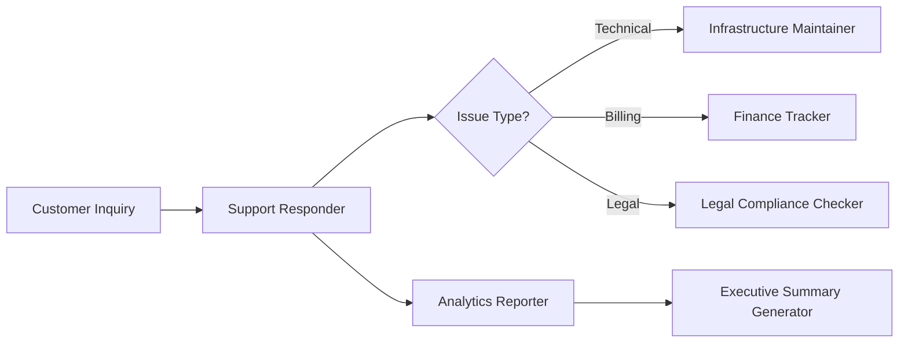
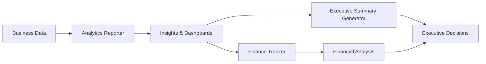
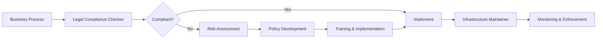

[根目录](../CLAUDE.md) > **support**

---

# Support Agents - AI Context Documentation

> **Category**: Support
> **Agent Count**: 6
> **Last Updated**: 2026-03-16

## 📋 Breadcrumb Navigation

[根目录](../CLAUDE.md) > **support**

---

## Module Overview

The Support category contains **6 specialized agents** covering the complete business support ecosystem, from customer service and analytics reporting to executive summaries, finance tracking, infrastructure maintenance, and legal compliance.

### Core Philosophy

Support agents are designed to be:
- **Customer-Centric**: Exceptional service, satisfaction-focused, relationship-building
- **Data-Driven**: Analytics-based insights, measurable outcomes, strategic decision support
- **Compliance-Conscious**: Legal adherence, risk mitigation, regulatory compliance
- **Operationally Excellent**: Reliable infrastructure, efficient processes, continuous improvement

---

## Agent Inventory

### Customer Success & Support (1 agent)

| Agent | Specialty | Key Capabilities |
|-------|-----------|------------------|
| **Support Responder** | Omnichannel customer support, issue resolution, customer success | Multi-channel support, knowledge management, CSAT optimization, proactive outreach |

### Analytics & Reporting (2 agents)

| Agent | Specialty | Key Capabilities |
|-------|-----------|------------------|
| **Analytics Reporter** | Data analysis, dashboard creation, business intelligence | Statistical analysis, KPI tracking, customer segmentation, marketing attribution |
| **Executive Summary Generator** | Strategic consulting, executive communication, decision support | McKinsey SCQA, BCG Pyramid, Bain frameworks, C-suite communication |

### Financial & Legal Operations (2 agents)

| Agent | Specialty | Key Capabilities |
|-------|-----------|------------------|
| **Finance Tracker** | Financial planning, budget management, performance analysis | Budgeting, cash flow management, investment analysis, cost optimization |
| **Legal Compliance Checker** | Regulatory compliance, risk assessment, policy development | GDPR/CCPA compliance, privacy policies, contract review, audit preparation |

### Infrastructure & Operations (1 agent)

| Agent | Specialty | Key Capabilities |
|-------|-----------|------------------|
| **Infrastructure Maintainer** | System reliability, performance optimization, operations management | Monitoring, automation, backup/recovery, security hardening |

---

## Key Interfaces & Workflows

### Customer Support Operations Workflow



**Agent Sequence**:
1. **Support Responder**: Handle initial customer inquiry with empathetic communication
2. **Infrastructure Maintainer**: Resolve technical infrastructure issues
3. **Finance Tracker**: Address billing and payment concerns
4. **Legal Compliance Checker**: Handle privacy and compliance requests
5. **Analytics Reporter**: Analyze support trends and customer satisfaction
6. **Executive Summary Generator**: Create executive summaries of support performance

### Business Intelligence & Reporting Workflow



**Agent Sequence**:
1. **Analytics Reporter**: Transform raw data into actionable insights
2. **Finance Tracker**: Provide financial context and ROI analysis
3. **Executive Summary Generator**: Synthesize findings into executive-ready format
4. **Decision Makers**: Make informed strategic decisions

### Compliance & Risk Management Workflow



**Agent Sequence**:
1. **Legal Compliance Checker**: Assess regulatory compliance requirements
2. **Risk Assessment**: Identify and quantify legal risks
3. **Policy Development**: Create compliant policies and procedures
4. **Training**: Implement compliance education programs
5. **Infrastructure Maintainer**: Enforce compliance through technical controls
6. **Monitoring**: Continuous compliance monitoring and reporting

---

## Technical Deliverables

### Customer Support Analytics Dashboard

```python
class SupportAnalyticsDashboard:
    def __init__(self, support_data):
        self.data = support_data
        self.metrics = {}

    def calculate_key_metrics(self):
        """
        Calculate comprehensive support performance metrics
        """
        self.metrics['avg_first_response_time'] = self.data['first_response_time'].mean()
        self.metrics['avg_resolution_time'] = self.data['resolution_time'].mean()
        self.metrics['first_contact_resolution_rate'] = (
            len(self.data[self.data['contacts_to_resolution'] == 1]) /
            len(self.data) * 100
        )
        self.metrics['customer_satisfaction_score'] = self.data['csat_score'].mean()

        return self.metrics

    def identify_support_trends(self):
        """
        Identify trends and patterns in support data
        """
        trends = {}

        # Ticket volume trends
        daily_volume = self.data.groupby(self.data['created_date'].dt.date).size()
        trends['volume_trend'] = 'increasing' if daily_volume.iloc[-7:].mean() > daily_volume.iloc[-14:-7].mean() else 'decreasing'

        # Common issue categories
        issue_frequency = self.data['issue_category'].value_counts()
        trends['top_issues'] = issue_frequency.head(5).to_dict()

        return trends
```

### Executive Summary Template

```markdown
# Executive Summary: [Topic Name]

## 1. SITUATION OVERVIEW
[Current state description with key context. What is happening and why executives should care right now.]

## 2. KEY FINDINGS
**Finding 1**: [Quantified insight]. **Strategic implication: [Impact on business].**
**Finding 2**: [Comparative data point]. **Strategic implication: [Impact on strategy].**
**Finding 3**: [Measured result]. **Strategic implication: [Impact on operations].**

## 3. BUSINESS IMPACT
**Financial Impact**: [Quantified revenue/cost impact with $ or % figures]
**Risk/Opportunity**: [Magnitude expressed as probability or percentage]
**Time Horizon**: [Specific timeline for impact realization]

## 4. RECOMMENDATIONS
**[Critical]**: [Action] — Owner: [Role/Name] | Timeline: [Specific dates] | Expected Result: [Quantified outcome]
**[High]**: [Action] — Owner: [Role/Name] | Timeline: [Specific dates] | Expected Result: [Quantified outcome]

## 5. NEXT STEPS
1. **[Immediate action 1]** — Deadline: [Date within 30 days]
2. **[Immediate action 2]** — Deadline: [Date within 30 days]
**Decision Point**: [Key decision required] by [Specific deadline]
```

### Financial Performance Dashboard

```sql
-- Monthly Financial Performance Report
WITH monthly_metrics AS (
  SELECT
    DATE_TRUNC('month', date) as month,
    SUM(revenue) as monthly_revenue,
    SUM(expenses) as monthly_expenses,
    SUM(revenue) - SUM(expenses) as net_income,
    COUNT(DISTINCT customer_id) as active_customers
  FROM financial_data
  WHERE date >= DATE_SUB(CURRENT_DATE(), INTERVAL 12 MONTH)
  GROUP BY DATE_TRUNC('month', date)
),
growth_calculations AS (
  SELECT *,
    LAG(monthly_revenue, 1) OVER (ORDER BY month) as prev_month_revenue,
    (monthly_revenue - LAG(monthly_revenue, 1) OVER (ORDER BY month)) /
     LAG(monthly_revenue, 1) OVER (ORDER BY month) * 100 as revenue_growth_rate
  FROM monthly_metrics
)
SELECT
  month,
  monthly_revenue,
  monthly_expenses,
  net_income,
  revenue_growth_rate,
  CASE
    WHEN revenue_growth_rate > 10 THEN 'High Growth'
    WHEN revenue_growth_rate > 0 THEN 'Positive Growth'
    ELSE 'Needs Attention'
  END as growth_status
FROM growth_calculations
ORDER BY month DESC;
```

### Infrastructure Monitoring Framework

```yaml
# Comprehensive Infrastructure Monitoring
monitoring:
  metrics:
    infrastructure:
      - cpu_usage
      - memory_usage
      - disk_space
      - network_throughput
    application:
      - response_time
      - error_rate
      - request_rate
      - uptime_percentage
    business:
      - active_users
      - transaction_volume
      - revenue_per_minute

  alerts:
    critical:
      - service_down
      - security_breach
      - data_loss
    warning:
      - high_cpu_usage
      - high_memory_usage
      - disk_space_low
    info:
      - deployment_complete
      - backup_successful
      - maintenance_scheduled
```

---

## Dependencies & Integrations

### External Service Dependencies

Support agents integrate with:

- **Customer Support Platforms**: Zendesk, Intercom, Freshdesk, Salesforce Service Cloud
- **Analytics Tools**: Google Analytics, Mixpanel, Amplitude, Tableau, Power BI
- **Financial Systems**: QuickBooks, Xero, NetSuite, SAP, Oracle Financials
- **Compliance Tools**: OneTrust, TrustArc, Vanta, ComplianceBoard
- **Infrastructure**: AWS, GCP, Azure, Datadog, New Relic, PagerDuty
- **Communication**: Slack, Microsoft Teams, Email, SMS, Voice

### Integration Patterns

```bash
# Convert support agents for different tools
./scripts/convert.sh --tool cursor     # .cursor/rules/*.mdc
./scripts/convert.sh --tool opencode   # .opencode/agents/*.md
./scripts/convert.sh --tool qwen       # .qwen/agents/*.md
```

---

## Testing & Quality Assurance

### Quality Standards for Support Agents

- ✅ **Customer Satisfaction**: All support interactions must meet CSAT targets
- ✅ **Data Accuracy**: Financial and analytical data must be validated and auditable
- ✅ **Compliance Adherence**: All processes must meet regulatory requirements
- ✅ **Response Times**: Support SLAs must be consistently met
- ✅ **Documentation**: Comprehensive documentation for all processes and decisions
- ✅ **Security**: Customer data must be protected with appropriate controls

### Success Metrics

Support agents should deliver:
- **Customer Satisfaction**: CSAT scores exceeding 4.5/5
- **First Contact Resolution**: 80%+ resolution rate on first interaction
- **Response Time Compliance**: 95%+ adherence to SLA requirements
- **Financial Accuracy**: 99%+ accuracy in financial reporting and forecasting
- **Compliance Score**: 98%+ adherence to regulatory requirements
- **System Uptime**: 99.9%+ infrastructure availability

---

## Common Workflows

### 1. Customer Issue Resolution Workflow

```
Support Responder → Infrastructure Maintainer/Finance Tracker/Legal Compliance Checker → Analytics Reporter → Executive Summary Generator
```

**Steps**:
1. Receive and triage customer inquiry (Support Responder)
2. Route to appropriate specialist based on issue type
3. Resolve technical/financial/legal issue (Specialist Agent)
4. Analyze support trends and patterns (Analytics Reporter)
5. Create executive summary of support performance (Executive Summary Generator)

### 2. Business Performance Review Workflow

```
Analytics Reporter → Finance Tracker → Executive Summary Generator → Leadership Team
```

**Steps**:
1. Gather and analyze business performance data (Analytics Reporter)
2. Provide financial context and ROI analysis (Finance Tracker)
3. Synthesize findings into executive summary (Executive Summary Generator)
4. Present to leadership for strategic decision-making

### 3. Compliance Audit Preparation Workflow

```
Legal Compliance Checker → Infrastructure Maintainer → Support Responder → External Auditor
```

**Steps**:
1. Conduct compliance gap analysis (Legal Compliance Checker)
2. Implement technical controls (Infrastructure Maintainer)
3. Train support team on compliance requirements (Support Responder)
4. Prepare documentation and evidence for audit (All Agents)

---

## FAQ

**Q: How do I choose between Support Responder and other support agents?**
A: Support Responder handles general customer inquiries and routes to specialists. Use Infrastructure Maintainer for technical issues, Finance Tracker for billing questions, and Legal Compliance Checker for privacy and compliance matters.

**Q: What's the difference between Analytics Reporter and Executive Summary Generator?**
A: Analytics Reporter performs detailed data analysis and creates comprehensive dashboards. Executive Summary Generator synthesizes complex information into concise, actionable summaries for C-suite decision-makers using consulting frameworks.

**Q: When should I use Finance Tracker vs. Legal Compliance Checker?**
A: Finance Tracker specializes in financial planning, budgeting, and financial analysis. Legal Compliance Checker focuses on regulatory compliance, privacy policies, and legal risk assessment.

**Q: Do these agents work together?**
A: Yes! Support agents are designed to collaborate. See the Common Workflows section for examples of multi-agent orchestration for comprehensive business support operations.

---

## Related Files

- **[CLAUDE.md](../CLAUDE.md)** - Root documentation
- **[CONTRIBUTING.md](../CONTRIBUTING.md)** - Contribution guidelines
- **[scripts/convert.sh](../scripts/convert.sh)** - Conversion pipeline
- **[scripts/install.sh](../scripts/install.sh)** - Installation script

---

## Changelog

### 2026-03-16 - Category Documentation Created
- 📊 **Agent Inventory**: Cataloged all 6 support agents
- ✨ **Workflow Diagrams**: Added customer support, analytics, and compliance workflows
- 📋 **Technical Deliverables**: Included code examples for analytics, executive summaries, finance, and infrastructure
- 🔗 **Integration Guide**: Documented tool compatibility and conversion
- ✅ **Quality Standards**: Defined success metrics and testing requirements

---

<div align="center">

**Support Agents** - Your Business Operations Team

6 Specialists • Full Support Spectrum • Customer-Centric Excellence

</div>
