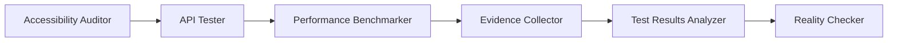
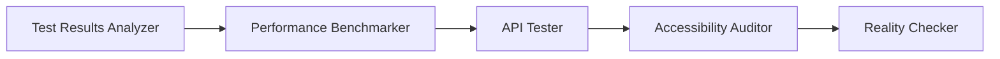
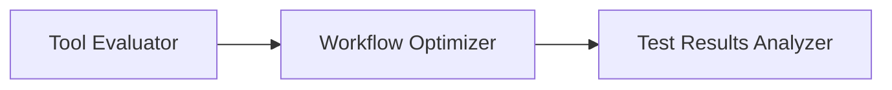

[根目录](../CLAUDE.md) > **testing**

---

# Testing Agents - AI Context Documentation

> **Category**: Testing
> **Agent Count**: 8
> **Last Updated**: 2026-03-16

## 📋 Breadcrumb Navigation

[根目录](../CLAUDE.md) > **testing**

---

## Module Overview

The Testing category contains **8 specialized agents** covering comprehensive quality assurance, including accessibility testing, API validation, performance benchmarking, test analysis, and workflow optimization. These agents ensure product quality through systematic testing, evidence-based analysis, and continuous improvement strategies.

### Core Philosophy

Testing agents are designed to be:
- **Quality-Focused**: Comprehensive testing coverage across functional, non-functional, and accessibility requirements
- **Evidence-Driven**: Data-driven analysis with statistical validation and measurable insights
- **User-Centered**: Testing from the user perspective with real-world scenarios and assistive technologies
- **Automation-First**: Automated testing frameworks with continuous integration and regression prevention

---

## Agent Inventory

### Accessibility & Quality Assurance (2 agents)

| Agent | Specialty | Key Technologies |
|-------|-----------|------------------|
| **Accessibility Auditor** | WCAG compliance, assistive technology testing, inclusive design | WCAG 2.2, ARIA, screen readers (VoiceOver, NVDA, JAWS), axe-core, Lighthouse |
| **Reality Checker** | Production readiness validation, evidence gathering, quality verification | Automated testing, manual QA, production monitoring, quality gates |

### API & Performance Testing (2 agents)

| Agent | Specialty | Key Technologies |
|-------|-----------|------------------|
| **API Tester** | API validation, security testing, performance benchmarking | REST/GraphQL, OWASP API Security, Playwright, k6, Postman, contract testing |
| **Performance Benchmarker** | Load testing, Core Web Vitals optimization, scalability assessment | k6, Lighthouse, WebPageTest, Real User Monitoring (RUM), performance profiling |

### Test Analysis & Intelligence (2 agents)

| Agent | Specialty | Key Technologies |
|-------|-----------|------------------|
| **Test Results Analyzer** | Test data analysis, quality metrics, release readiness assessment | Statistical analysis, machine learning, predictive modeling, quality dashboards |
| **Evidence Collector** | Test evidence gathering, documentation, quality artifact management | Screenshot capture, video recording, log collection, evidence organization |

### Tools & Workflow Optimization (2 agents)

| Agent | Specialty | Key Technologies |
|-------|-----------|------------------|
| **Tool Evaluator** | Testing tool assessment, ROI analysis, technology selection | Feature comparison, TCO calculation, usability testing, vendor assessment |
| **Workflow Optimizer** | Testing process improvement, CI/CD optimization, automation strategy | Pipeline automation, test orchestration, efficiency analysis, process redesign |

---

## Key Interfaces & Workflows

### Common Testing Patterns

#### Comprehensive Quality Assurance Workflow



**Agent Sequence**:
1. **Accessibility Auditor**: Validate WCAG compliance and assistive technology compatibility
2. **API Tester**: Execute functional, security, and performance API testing
3. **Performance Benchmarker**: Conduct load testing and Core Web Vitals optimization
4. **Evidence Collector**: Gather comprehensive test evidence and documentation
5. **Test Results Analyzer**: Analyze results and generate quality insights
6. **Reality Checker**: Validate production readiness with comprehensive quality assessment

#### Release Readiness Assessment Workflow



**Agent Sequence**:
1. **Test Results Analyzer**: Analyze test coverage and quality metrics
2. **Performance Benchmarker**: Validate performance SLA compliance
3. **API Tester**: Verify API functionality and security
4. **Accessibility Auditor**: Confirm accessibility standards compliance
5. **Reality Checker**: Conduct final production readiness validation

#### Testing Tool Selection Workflow



**Agent Sequence**:
1. **Tool Evaluator**: Assess testing tools with ROI and feature analysis
2. **Workflow Optimizer**: Integrate selected tools into optimized testing workflows
3. **Test Results Analyzer**: Validate tool effectiveness through quality metrics

---

## Technical Deliverables

### Accessibility Audit Report Example

```markdown
# Accessibility Audit Report

## 📋 Audit Overview
**Product/Feature**: E-commerce Checkout Flow
**Standard**: WCAG 2.2 Level AA
**Date**: 2026-03-16
**Testing Methods**: axe-core, VoiceOver (macOS), NVDA (Windows), keyboard-only navigation

## 📊 Summary
**Total Issues Found**: 23
- Critical: 3 - Blocks task completion
- Serious: 8 - Major barriers requiring workarounds
- Moderate: 9 - Causes difficulty but has workarounds
- Minor: 3 - Annoyances that reduce usability

**WCAG Conformance**: DOES NOT CONFORM
**Assistive Technology Compatibility**: PARTIAL

## 🚨 Critical Issues

### Issue 1: Checkout Form Missing Labels
**WCAG Criterion**: 2.4.6 Labels or Instructions (A)
**Severity**: Critical
**User Impact**: Screen reader users cannot complete purchase - form fields announced as "blank" with no purpose
**Location**: Checkout page, payment form fields
**Recommended Fix**: Add properly associated labels using `for` attribute or `aria-label`
```

### API Test Suite Example

```javascript
// Comprehensive API testing with Playwright
import { test, expect } from '@playwright/test';

describe('Payment API Testing', () => {
  test('should process payment with valid data', async ({ request }) => {
    const response = await request.post('/api/payments', {
      data: {
        amount: 99.99,
        currency: 'USD',
        method: 'credit_card',
        token: 'tok_visa'
      }
    });

    expect(response.status()).toBe(201);
    const payment = await response.json();
    expect(payment.status).toBe('succeeded');
    expect(payment.id).toMatch(/^pay_/);
  });

  test('should reject invalid payment amounts', async ({ request }) => {
    const response = await request.post('/api/payments', {
      data: {
        amount: -50.00,
        currency: 'USD',
        method: 'credit_card'
      }
    });

    expect(response.status()).toBe(400);
    const error = await response.json();
    expect(error.error).toContain('Invalid amount');
  });
});
```

### Performance Testing Script Example

```javascript
// k6 performance testing for critical user journeys
import http from 'k6/http';
import { check, sleep } from 'k6';

export const options = {
  stages: [
    { duration: '2m', target: 10 },   // Warm up
    { duration: '5m', target: 50 },   // Normal load
    { duration: '2m', target: 100 },  // Peak load
    { duration: '5m', target: 100 },  // Sustained peak
    { duration: '2m', target: 0 },    // Cool down
  ],
  thresholds: {
    http_req_duration: ['p(95)<500'],  // 95% under 500ms
    http_req_failed: ['rate<0.01'],    // Error rate under 1%
  },
};

export default function () {
  // Test checkout flow
  const browse = http.get('https://shop.example.com/products');
  check(browse, {
    'browse status': (r) => r.status === 200,
    'browse response time': (r) => r.timings.duration < 300,
  });

  sleep(1);

  const addToCart = http.post('https://shop.example.com/api/cart/items', {
    product_id: 'prod_123',
    quantity: 1
  });
  check(addToCart, {
    'add to cart status': (r) => r.status === 201,
  });

  sleep(1);
}
```

---

## Dependencies & Integrations

### Testing Framework Dependencies

Testing agents integrate with various testing frameworks and tools:

**Accessibility Testing**:
- **Automated**: axe-core, Lighthouse, Pa11y, WAVE
- **Manual**: Screen readers (VoiceOver, NVDA, JAWS), keyboard testing
- **Frameworks**: Jest-axe, @testing-library/jest-dom

**API Testing**:
- **Tools**: Playwright, REST Assured, Postman, k6, JMeter
- **Libraries**: Axios, Supertest, Requests
- **Contract Testing**: Pact, Spring Cloud Contract

**Performance Testing**:
- **Load Testing**: k6, JMeter, Gatling, Locust
- **Web Performance**: Lighthouse, WebPageTest, PageSpeed Insights
- **Monitoring**: Real User Monitoring (RUM), synthetic monitoring

**Test Analysis**:
- **Statistical**: Python (pandas, scipy, scikit-learn), R
- **Visualization**: Matplotlib, Plotly, Grafana
- **ML Frameworks**: TensorFlow, PyTorch for defect prediction

### Integration Patterns

```bash
# Convert testing agents for different tools
./scripts/convert.sh --tool cursor     # .cursor/rules/*.mdc
./scripts/convert.sh --tool opencode   # .opencode/agents/*.md
./scripts/convert.sh --tool qwen       # .qwen/agents/*.md
```

---

## Testing & Quality Assurance

### Quality Standards for Testing Agents

- ✅ **Comprehensive Coverage**: Test all functional, non-functional, and accessibility requirements
- ✅ **Evidence-Based**: Document findings with screenshots, logs, and reproducible steps
- ✅ **Statistical Validation**: Use statistical methods for performance and quality analysis
- ✅ **User-Focused**: Test from the user perspective with real-world scenarios
- ✅ **Automation-First**: Prioritize automated testing with manual validation where needed
- ✅ **Continuous Improvement**: Learn from test results and prevent recurring issues

### Success Metrics

Testing agents should deliver:
- **High Coverage**: 95%+ test coverage for critical functionality
- **Early Detection**: 90% of defects found in pre-production testing
- **Performance Compliance**: 100% SLA compliance for performance requirements
- **Accessibility Standards**: WCAG 2.2 AA compliance for all user-facing features
- **Fast Feedback**: Test results within 15 minutes for automated test suites

---

## Common Workflows

### 1. Pre-Release Testing Workflow

```
Accessibility Auditor → API Tester → Performance Benchmarker → Test Results Analyzer → Reality Checker
```

**Steps**:
1. Validate accessibility compliance (Accessibility Auditor)
2. Execute comprehensive API testing (API Tester)
3. Conduct performance and load testing (Performance Benchmarker)
4. Analyze test results and quality metrics (Test Results Analyzer)
5. Validate production readiness (Reality Checker)

### 2. Continuous Testing Workflow

```
Developer Commit → Automated Tests → Test Results Analyzer → Workflow Optimizer
```

**Steps**:
1. Developer commits code changes
2. Automated tests execute in CI/CD pipeline
3. Test Results Analyzer evaluates quality trends
4. Workflow Optimizer refines testing process based on insights

### 3. Tool Evaluation Workflow

```
Tool Evaluator → Workflow Optimizer → Test Results Analyzer
```

**Steps**:
1. Evaluate testing tools with comprehensive assessment (Tool Evaluator)
2. Integrate selected tools into optimized workflows (Workflow Optimizer)
3. Validate tool effectiveness through quality metrics (Test Results Analyzer)

---

## FAQ

**Q: What's the difference between API Tester and Performance Benchmarker?**
A: API Tester focuses on API functionality, security, and contract testing. Performance Benchmarker specializes in load testing, stress testing, and Core Web Vitals optimization across the entire system.

**Q: When should I use Accessibility Auditor vs. Reality Checker?**
A: Accessibility Auditor specializes in WCAG compliance and assistive technology testing. Reality Checker provides broader production readiness validation including accessibility, functionality, and quality assurance.

**Q: How do Test Results Analyzer and Evidence Collector work together?**
A: Evidence Collector gathers comprehensive test artifacts (screenshots, logs, recordings). Test Results Analyzer analyzes these artifacts along with test data to generate insights, trends, and recommendations.

**Q: Can testing agents work with development agents?**
A: Yes! Testing agents collaborate extensively with development agents. For example, Accessibility Auditor works with Frontend Developer to ensure accessible implementations, and API Tester collaborates with Backend Architect on API design validation.

---

## Related Files

- **[CLAUDE.md](../CLAUDE.md)** - Root documentation
- **[engineering/CLAUDE.md](../engineering/CLAUDE.md)** - Engineering agents (development partners)
- **[CONTRIBUTING.md](../CONTRIBUTING.md)** - Contribution guidelines
- **[scripts/convert.sh](../scripts/convert.sh)** - Conversion pipeline
- **[scripts/install.sh](../scripts/install.sh)** - Installation script

---

## Changelog

### 2026-03-16 - Category Documentation Created
- 📊 **Agent Inventory**: Cataloged all 8 testing agents
- ✨ **Workflow Diagrams**: Added common testing workflows and release assessment flows
- 📋 **Technical Deliverables**: Included accessibility audit templates, API test suites, and performance testing scripts
- 🔗 **Integration Guide**: Documented testing frameworks, tools, and compatibility
- ✅ **Quality Standards**: Defined success metrics and comprehensive testing requirements

---

<div align="center">

**Testing Agents** - Your Quality Assurance Team

8 Specialists • Comprehensive Testing • Quality-First Approach

</div>
